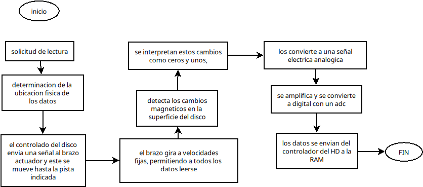

# Trabajo-SO
### Santiago Gonzalez Lara <br>Sistemas Operativos<br>Profesor: Eduardo Alcaraz
### trabajo sistemas operativos <br>2 de diciembre de 2024


## Administración de Memoria<br>
### 3.1 Política y filosofía
1. **¿Cuál es la diferencia entre fragmentación interna y externa? Explica cómo cada una afecta el rendimiento de la memoria.**<br>
la fragmentacion interna es cuando un proceso es mas pequeño que su partición asignada, la memoria sobrante de la particion es inutilizable y a eso se le llama fragmentacion interna, en cambio la externa es cuando hay espacios de memoria sobrantes donde ya no cabe un proceso.<br> afecta porque tanto dentro de las particiones como fuera desperdicia pequeños espacios que acumulados podrían ser utilizados para muchos otros procesos.
2. **Investiga y explica las políticas de reemplazo de páginas en sistemas operativos. ¿Cuál consideras más eficiente y por qué?**<br>
las politicas de reemplazo de pagina se utilizan cuando un programa intenta acceder a una pagina de la memoria aun no cargada en la memoria principal(RAM), lo que produce que el proceso no pueda continuar hasta que tenga acceso a dicha pagina, a esto se le conooce como fallo de pagina, y lo que hay que hacer es reemplazar una pagina que ya está cargada en ram por la que necesitamos que esté cargada, a la forma de seleccionar la pagina a reemplazar la conocemos como 'politica de reemplazo' o 'politica de sustitucion'
    - **optimo:** selecciona a reemplazar la pagina que tardará mas en volver a ser utilizada. para ciertas cantidades fijas de marcos es la que menos produce fallos, y esto precisamente es lo que lo hace dificil de implementar, pues predecir que paginas se referenciarán en un futuro no es posible.
    - **FIFO:** saca de la memoria a la pagina que primero haya llegado, la más antigua en la memoria. Super simple de implementar, simplemente se utiliza un puntero para la pagina mas antigua y otro para la añadida mas recientemente, cuando hay un fallo simplemente se elimina la mas vieja y se añade la nueva pagina al final de la lista. Si bien es simple. puede presentiar fenomenos que mientras mas marcos utilicemos, mas fallos de pagina se presenten.
    - **LRU(Less Recently Used):** se basa en el principio de la cercania de referencia, tambien conocido como principio de localidad, que establece que las referencias a codigo y datos tienden a agruparse y no cambiar en periodos cortos de tiempo. Bajo este principio es organizar 'jerarquicamente' la prioridad con la que se hacen referencia a ciertos espacios de memoria, o por lo menos una estimación. El algoritmo LRU se basa en ello, para deducir que la pagina que tiene mas tiempo sin ser referenciada es la que tiene menor probabilidad de ser referenciada, esto hace que se aproxime mucho al algoritmo optimo. Funciona como una pila, lo que hace que no presente la anomalia de Belady (a más marcos, mas fallas). Tiene mejores resultados que el algoritmo fifo, pero sufre de varios defectos de los que sufre el algoritmo optimo, ademas que implementar una pila es dificil, por lo que se sugiere usar una pila doblemente enlazada, lo que lo hace mas eficaz pero su utilizacion ocuparia demasiados recursos, pues puede modificar hasta 6 punteros por un reemplazo de pagina.
    - **RELOJ:** se basa en en los buenos resultados que salen de utilizar pilas, y los bajos costos del algoritmo FIFO, utiliza hardware para facilitar su implementación y ser mas eficiente. Consiste en añadirle a cada marco un bit de referencia, que se modificará en base a la pagina.<br>
    Cuando la pagina se carga a memoria, el bit de referencia se cambia a 1, asi como cuando se referencie a la pagina, nuevamente se le marcará con 1(o se mantendrá). Se mantiene haciendo un recorrido circular cuando hay paginas sin haber sido referenciadas o cuando se necesita hacer un reempĺazo, hace un recorrido 'circular' por toda la lista, durante su ciclo, recorre los los marcos en busca de una pagina que no haya sido referenciada, y desactiva los bits de referencia a su paso. En caso de que en un ciclo todos los bits de referencia estén activos, dará un ciclo completo para desactivarlos todos y así, ya devuelta en el inicio de la lista circular, haga el reemplazo sobre el primer elemento integrado a la lista, tal como FIFO.<BR>
    Aumentar el tamaño del bit de referencia de cada marco, aumenta su complejidad y en ciertos casos puede dar mejores resultados, pues nos da mas informacion acerca de las paginas<br>
        - **RELOJ MEJORADO:** consiste en utilizar 2 bits de referencia en lugar de 1, el bit menos significativo representa el bit de modificacion, mientras que el mas significativo representa el bit de referencia. esto nos lleva a que una pagina puede tener 4 estados:<br>

            |Bit modificación|Bit referencia|significado|
            |----------------|--------------|-----------|
            |0               |0             |sin modificacion ni referencia|
            |0               |1             |no ha sido referenciado, pero si modificado|
            |1               |0             |ha sido referenciado recientemente pero no modificado
            |1               |1             |se ha referenciado y modificado recientemente|
            
            el algoritmo lo que hace es en base a esta informacion extra, definir los que menos prioridad tengan para permanecer en memoria.
             1. primero, busca las paginas de tipo (0,0), de encontrar una la sustituye
             2. recorre la lista buscando la primer pagina de tipo (0,1), durante esta busqueda desactiva el bit de referencia que lo tengan en uno
             3. regresa al paso 1, pues en este paso ya todos los bits tanto de referencia como de modificación habran regresado al estado (0,0)

### 3.2 Memoria real
1. **Escribe un programa en C o Python que simule la administración de memoria mediante particiones fijas.** <br>
```C
#include <stdio.h>
#include <stdlib.h>
#include <string.h>

#define MAX_PROCESOS 100
#define NUM_PARTICIONES 10

typedef struct {
    int tamaño;
    int id_de_proceso; 
} Particion;

void imprime_memoria(Particion particiones[], int numero_de_particiones) {
    printf("\nEstado actual de la memoria:\n");
    for (int i = 0; i < numero_de_particiones; i++) {
        if (particiones[i].id_de_proceso == -1) {
            printf("Partición %d: %d KB (Espacio libre)\n", i + 1, particiones[i].tamaño);
        } else {
            printf("Partición %d: %d KB (Asignada al proceso %d)\n", i + 1, particiones[i].tamaño, particiones[i].id_de_proceso);
        }
    }
    printf("\n");
}

int main() {
    int memoria_total;
    Particion particiones[NUM_PARTICIONES];

    // Solicitar el tamaño total de la memoria
    printf("Introduzca el tamaño total de la memoria en KB: ");
    scanf("%d", &memoria_total);

    int tamaño_total_particion = memoria_total/NUM_PARTICIONES;
    printf("La memoria se dividirá en 10 particiones.\n");

    for (int i = 0; i < NUM_PARTICIONES; i++) {
        particiones[i].tamaño=tamaño_total_particion;
        particiones[i].id_de_proceso = -1; 

    }

    if (tamaño_total_particion > memoria_total) {
        printf("Error: El tamaño total de las particiones excede el tamaño de la memoria disponible.\n");
        return 1;
    }

    int opcion;
    do {
        printf("\n--- Menú de opciones ---\n");
        printf("1. Asignar un proceso\n");
        printf("2. Liberar un proceso\n");
        printf("3. Ver el estado actual de la memoria\n");
        printf("4. Salir del programa\n");
        printf("Seleccione una opción: ");
        scanf("%d", &opcion);

        switch (opcion) {
            case 1: {
                int id_de_proceso, tam_proceso;
                printf("Indique el ID del proceso que desea asignar: ");
                scanf("%d", &id_de_proceso);
                printf("Especifique el tamaño del proceso en KB: ");
                scanf("%d", &tam_proceso);

                int asignado = 0;
                for (int i = 0; i < NUM_PARTICIONES; i++) {
                    if (particiones[i].id_de_proceso == -1 && particiones[i].tamaño >= tam_proceso) {
                        particiones[i].id_de_proceso = id_de_proceso;
                        asignado = 1;
                        printf("El proceso %d fue asignado a la partición %d.\n", id_de_proceso, i + 1);
                        break;
                    }
                }
                if (!asignado) {
                    printf("No hay particiones disponibles para asignar el proceso %d.\n", id_de_proceso);
                }
                break;
            }
            case 2: {
                int id_de_proceso;
                printf("Indique el ID del proceso que desea liberar: ");
                scanf("%d", &id_de_proceso);

                int liberado = 0;
                for (int i = 0; i < NUM_PARTICIONES; i++) {
                    if (particiones[i].id_de_proceso == id_de_proceso) {
                        particiones[i].id_de_proceso = -1;
                        liberado = 1;
                        printf("El proceso %d fue liberado de la partición %d.\n", id_de_proceso, i + 1);
                        break;
                    }
                }
                if (!liberado) {
                    printf("No se encontró el proceso %d en ninguna partición.\n", id_de_proceso);
                }
                break;
            }
            case 3:
                imprime_memoria(particiones, NUM_PARTICIONES);
                break;
            case 4:
                printf("Saliendo del programa. Gracias por usarlo.\n");
                break;
            default:
                printf("Opción no válida. Por favor, intente de nuevo.\n");
        }
    } while (opcion != 4);

    return 0;
}

```
nota: al ejecutarse, aunque el proceso no supera el tamaño de la particion, pero si el limite de particiones a la vez, con lo que no se asigna

2. **Diseña un algoritmo para calcular qué procesos pueden ser asignados a un sistema con memoria real limitada utilizando el algoritmo de "primera cabida"**.<br>

    1. Solicitar el identificador del proceso.  

    2. Solicitar el tamaño del proceso.  

    3. Examinar cada bloque de memoria disponible y comprobar si está desocupado y tiene capacidad suficiente para alojar el proceso**.  

    4. En cuanto se localice un bloque adecuado, asignar el proceso a ese espacio y marcarlo con su identificador correspondiente**.  

    5. Si no se encuentra ningún bloque apropiado, mostrar un mensaje indicando que no hay suficiente espacio disponible y finalizar**.  

### 3.3 Organización de memoria virtual
1. **Investiga y explica el concepto de "paginación" y "segmentación". ¿Cuáles son las ventajas y desventajas de cada técnica?**<br>
Paginación: consiste en dividir la memoria fisica en  del mismo tamaño llamados marcos, y la memoria logica la dividimos en bloques del mismo del marco, cuando se necesita cargar un programa en memoria, se cargan las paginas en los marcos, sin que sea necesario que estén contiguos. Esto elimina la fragmentación externa, aunque deja algo de fragmentacion interna en la ultima pagina del codigo<br>
segmentacion:  tampoco exigue que esté de forma contigua, el programa se carga en espacios de memoria de tamaño irregular, segun el tamaño de los espacios disponibles y el tamaño del programa. para gestionar este tipo de administracion de memoria, se necesita una tabla de segmentos, para guardar las direcciones, ademas se necesita llevar el control de las zonas libres y ocupadas.
2. **Escribe un programa que simule una tabla de páginas para procesos con acceso aleatorio a memoria virtual.**<br>
```c
#include <stdio.h>
#include <stdlib.h>
#include <time.h>

#define TAM_PAGINA 1024
#define NUM_PAGINAS 16
#define MEMORIA_VIRTUAL 16384

typedef struct {
    int numero_pagina;
    int numero_marco;
    int valido;
} EntradaTablaPaginas;

int memoria_fisica[NUM_PAGINAS][TAM_PAGINA];

void inicializar_tabla_paginas(EntradaTablaPaginas *tabla_paginas) {
    for (int i = 0; i < NUM_PAGINAS; i++) {
        tabla_paginas[i].numero_pagina = i;
        tabla_paginas[i].numero_marco = -1;
        tabla_paginas[i].valido = 0;
    }
}

void cargar_pagina(EntradaTablaPaginas *tabla_paginas, int numero_pagina) {
    if (tabla_paginas[numero_pagina].valido == 0) {
        tabla_paginas[numero_pagina].numero_marco = numero_pagina;
        tabla_paginas[numero_pagina].valido = 1;
        printf("Página %d cargada en el marco %d.\n", numero_pagina, tabla_paginas[numero_pagina].numero_marco);
    }
}

void acceder_memoria(EntradaTablaPaginas *tabla_paginas, int direccion_virtual) {
    int numero_pagina = direccion_virtual / TAM_PAGINA;
    int desplazamiento = direccion_virtual % TAM_PAGINA;

    if (numero_pagina >= NUM_PAGINAS) {
        printf("Error: Dirección virtual fuera de rango.\n");
        return;
    }

    if (tabla_paginas[numero_pagina].valido == 0) {
        printf("Fallo de página en la página %d. Cargando la página...\n", numero_pagina);
        cargar_pagina(tabla_paginas, numero_pagina);
    }

    int numero_marco = tabla_paginas[numero_pagina].numero_marco;
    int direccion_fisica = (numero_marco * TAM_PAGINA) + desplazamiento;

    printf("Dirección virtual %d -> Dirección física %d (Página %d, Marco %d, Desplazamiento %d)\n",
           direccion_virtual, direccion_fisica, numero_pagina, numero_marco, desplazamiento);
}

int main() {
    EntradaTablaPaginas tabla_paginas[NUM_PAGINAS];
    int direccion_virtual;

    inicializar_tabla_paginas(tabla_paginas);
    srand(time(NULL));
    for (int i = 0; i < 5; i++) {
        direccion_virtual = rand() % MEMORIA_VIRTUAL;
        printf("\nAcceso a la dirección virtual: %d\n", direccion_virtual);
        acceder_memoria(tabla_paginas, direccion_virtual);
    }
    return 0;
}
```
### 3.4 Administración de memoria virtual
1. **Escribe un código que implemente el algoritmo de reemplazo de página "Least Recently Used" (LRU).<br>**
para ejecutarlo, tomar en cuenta:<br>gcc codigos/implementacionLRU.c -o implementacionLRU -lm
./implementacionLRU
```c
#include <stdio.h>
#include <stdlib.h>
#include <time.h>
#include <math.h>
#include <stdbool.h>


 
typedef struct PaginaTabla{
    int indicePagina;
    int marcoAsignado;
    int cargada;
    int ultimoUso;
} PaginaTabla;

typedef struct Pagina{
    int numeroPagina;
    int tamanio;
} Pagina;

typedef struct Proceso{
    int PID;
    int cantidadPaginas;
    int tamanio;
    PaginaTabla *tablaPaginas;
    struct Proceso *siguiente;
} Proceso;

typedef struct Marco{
    int numeroMarco;
    int paginaAsignada;
    int idProceso;
} Marco;


 
#define TAM_MEMORIA_FISICA 8
#define TAM_PAGINA 4

int totalMarcos = TAM_MEMORIA_FISICA / TAM_PAGINA;
int contadorProceso = 1;
int contadorUso = 0;
Marco memoriaFisica[TAM_MEMORIA_FISICA / TAM_PAGINA];

Proceso *cabeza = NULL;
	

void aplicarLRU();

void imprimirTablasProcesos() {
    if (cabeza == NULL) {
        printf("No hay procesos registrados.\n");
        return;
    }

    Proceso *procesoActual = cabeza;
    printf("----------------------------------------\n");
    while (procesoActual != NULL) {
        printf("| PID: %d | Tamaño Proceso: %d KB | Páginas: %d |\n\n", procesoActual->PID, procesoActual->tamanio, procesoActual->cantidadPaginas);
        for (int i = 0; i < procesoActual->cantidadPaginas; i++) {
            printf("| Página %d | Marco asignado %d | Cargada %d |\n", procesoActual->tablaPaginas[i].indicePagina, procesoActual->tablaPaginas[i].marcoAsignado, procesoActual->tablaPaginas[i].cargada);
        }
        printf("----------------------------------------\n");
        procesoActual = procesoActual->siguiente;
    }
}

void imprimirMemoriaFisica() {
    printf("-- Memoria Física --\n");
    for (int i = 0; i < totalMarcos; i++) {
        if (memoriaFisica[i].paginaAsignada != -1) {
            int pidProceso = memoriaFisica[i].idProceso;
            Proceso *aux = cabeza;
            while (aux != NULL && aux->PID != pidProceso) {
                aux = aux->siguiente;
            }

            if (aux != NULL) {
                for (int j = 0; j < aux->cantidadPaginas; j++) {
                    if (aux->tablaPaginas[j].marcoAsignado == i) {
                        printf("| Marco: %d | Página: %d | (Proceso ID: %d) | Último Uso: %d \n",
                               i, aux->tablaPaginas[j].indicePagina, aux->PID, aux->tablaPaginas[j].ultimoUso);
                        break;
                    }
                }
            }
        } else {
            printf("Marco %d: Libre\n", i);
        }
    }
}

int calcularPaginas(int *tam) {
    return (int)ceil((float)*tam / TAM_PAGINA);
}

void crearProceso() {
    int tam = 0;
    printf("Ingresa el tamaño del proceso (KB): ");
    scanf("%d", &tam);

    Proceso *nuevoProceso = (Proceso*)malloc(sizeof(Proceso));
    nuevoProceso->PID = contadorProceso;
    nuevoProceso->tamanio = tam;
    nuevoProceso->cantidadPaginas = calcularPaginas(&tam);
    nuevoProceso->tablaPaginas = (PaginaTabla*)malloc(sizeof(PaginaTabla) * nuevoProceso->cantidadPaginas);

    for (int i = 0; i < nuevoProceso->cantidadPaginas; i++) {
        nuevoProceso->tablaPaginas[i].indicePagina = i;
        nuevoProceso->tablaPaginas[i].cargada = 0;
        nuevoProceso->tablaPaginas[i].marcoAsignado = -1;
    }

    nuevoProceso->siguiente = cabeza;
    cabeza = nuevoProceso;
    contadorProceso++;
}

void asignarPaginas() {
    if (cabeza == NULL) {
        printf("No hay procesos creados.\n");
        return;
    }

    printf("Selecciona el proceso para asignar páginas:\n");
    Proceso *temp = cabeza;
    while (temp != NULL) {
        printf("| ID: %d | Tamaño: %d KB | Páginas: %d |\n", temp->PID, temp->tamanio, temp->cantidadPaginas);
        temp = temp->siguiente;
    }

    printf("Ingresa el ID del proceso: ");
    int idProceso;
    scanf("%d", &idProceso);

    Proceso *temp2 = cabeza;
    while (temp2 != NULL) {
        if (temp2->PID == idProceso) {
            int todasAsignadas = 1;
            for (int i = 0; i < temp2->cantidadPaginas; i++) {
                if (temp2->tablaPaginas[i].marcoAsignado == -1) {
                    todasAsignadas = 0;
                    break;
                }
            }

            for (int i = 0; i < temp2->cantidadPaginas; i++) {
                printf("| Página %d | Marco asignado: %d | Cargada: %d |\n", temp2->tablaPaginas[i].indicePagina, temp2->tablaPaginas[i].marcoAsignado, temp2->tablaPaginas[i].cargada);
            }

            int opc = 0;
            do {
                int pagSeleccionada;
                printf("Selecciona el número de página a cargar en memoria: ");
                scanf("%d", &pagSeleccionada);

                if (pagSeleccionada < 0 || pagSeleccionada >= temp2->cantidadPaginas) {
                    printf("Página inválida.\n");
                    return;
                }

                if (temp2->tablaPaginas[pagSeleccionada].marcoAsignado != -1) {
                    printf("Página ya asignada. Actualizando último uso.\n");
                    temp2->tablaPaginas[pagSeleccionada].ultimoUso = contadorUso;
                    contadorUso++;
                    return;
                }

                int marcosLibres[totalMarcos];
                int numLibres = 0;
                for (int i = 0; i < totalMarcos; i++) {
                    if (memoriaFisica[i].paginaAsignada == -1) {
                        marcosLibres[numLibres++] = i;
                    }
                }

                if (numLibres == 0) {
                    aplicarLRU();
                }

                numLibres = 0;
                for (int i = 0; i < totalMarcos; i++) {
                    if (memoriaFisica[i].paginaAsignada == -1) {
                        marcosLibres[numLibres++] = i;
                    }
                }

                int marcoAleatorio = marcosLibres[rand() % numLibres];
                memoriaFisica[marcoAleatorio].paginaAsignada = temp2->tablaPaginas[pagSeleccionada].indicePagina;
                memoriaFisica[marcoAleatorio].idProceso = temp2->PID;
                temp2->tablaPaginas[pagSeleccionada].marcoAsignado = marcoAleatorio;
                temp2->tablaPaginas[pagSeleccionada].cargada = 1;
                temp2->tablaPaginas[pagSeleccionada].ultimoUso = contadorUso;
                contadorUso++;

                printf("Página %d asignada al marco %d.\n", pagSeleccionada, marcoAleatorio);
                todasAsignadas = 1;
                for (int i = 0; i < temp2->cantidadPaginas; i++) {
                    if (temp2->tablaPaginas[i].marcoAsignado == -1) {
                        todasAsignadas = 0;
                        break;
                    }
                }

                if (todasAsignadas) {
                    return;
                }

                printf("1.- Asignar otra página\n");
                printf("0.- Salir\n");
                scanf("%d", &opc);
            } while (opc != 0);

            return;
        }
        temp2 = temp2->siguiente;
    }

    printf("Proceso no encontrado.\n");
}

void aplicarLRU() {
    if (cabeza == NULL) {
        printf("No hay procesos registrados.\n");
        return;
    }

    Proceso *temp2 = cabeza;
    int paginaEliminar = -1;
    int menorUso = contadorUso;
    Proceso *auxProceso = NULL;

    while (temp2 != NULL) {
        for (int i = 0; i < temp2->cantidadPaginas; i++) {
            if (temp2->tablaPaginas[i].cargada && temp2->tablaPaginas[i].ultimoUso < menorUso) {
                menorUso = temp2->tablaPaginas[i].ultimoUso;
                paginaEliminar = i;
                auxProceso = temp2;
            }
        }
        temp2 = temp2->siguiente;
    }

    if (paginaEliminar == -1) {
        printf("No se encontró página cargada para eliminar.\n");
        return;
    }

    if (auxProceso != NULL) {
        int marcoLiberado = auxProceso->tablaPaginas[paginaEliminar].marcoAsignado;
        memoriaFisica[marcoLiberado].paginaAsignada = -1;
        auxProceso->tablaPaginas[paginaEliminar].marcoAsignado = -1;
        auxProceso->tablaPaginas[paginaEliminar].cargada = 0;
        printf("Página %d eliminada del marco %d del proceso[%d].\n", paginaEliminar, marcoLiberado, memoriaFisica[marcoLiberado].idProceso);
        printf("\n");
        memoriaFisica[marcoLiberado].idProceso = -1;
    }
}

int main() {
    srand(time(NULL));

    // Inicializar Memoria Física
    for (int i = 0; i < totalMarcos; i++) {
        memoriaFisica[i].numeroMarco = i;
        memoriaFisica[i].paginaAsignada = -1;
    }

    int opcion = 0;
    do {
        printf("------------- Menú -------------\n");
        printf("1.- Crear Proceso\n");
        printf("2.- Asignar Páginas\n");
        printf("3.- Mostrar Procesos\n");
        printf("4.- Mostrar Memoria Física\n");
        printf("5.- Salir\n");
        printf("--------------------------------\n");
        scanf("%d", &opcion);

        switch (opcion) {
            case 1:
                crearProceso();
                break;
            case 2:
                asignarPaginas();
                break;
            case 3:
                imprimirTablasProcesos();
                break;
            case 4:
                imprimirMemoriaFisica();
                break;
            case 5:
                return 0;
            default:
                printf("Opción inválida\n");
                break;
        }
    } while (true);

    return 0;
}

```

2. **Diseña un diagrama que represente el proceso de traducción de direcciones virtuales a físicas en un sistema con memoria virtual.**<br>


### Integración
1. **Analiza un sistema operativo moderno (por ejemplo, Linux o Windows) e identifica cómo administra la memoria virtual.**<br>
#### gestión de Memoria Virtual en Windows:

Al igual que Linux (con Ubuntu como ejemplo), Windows utiliza un esquema de paginación para implementar la memoria virtual. Esto significa que tanto la memoria RAM física como el espacio de almacenamiento en disco (reservado para la memoria virtual) se dividen en unidades llamadas páginas. En Windows, el tamaño de página es variable, aunque comúnmente es de 4 KB, similar a la configuración estándar de Ubuntu.

#### Archivo de Paginación (Equivalente al Swap de Linux):

En Windows, el equivalente al swap de Linux se conoce como archivo de paginación o pagefile.sys. Este archivo reside en el disco duro (normalmente en la partición del sistema) y sirve como una extensión de la RAM física. Cuando la memoria RAM se llena, Windows mueve las páginas menos utilizadas de la RAM al archivo de paginación para liberar espacio para las aplicaciones que lo necesitan. Al igual que con el swap, un uso excesivo del archivo de paginación puede ralentizar el sistema, ya que el acceso al disco es mucho más lento que el acceso a la RAM.

#### Unidad de Gestión de Memoria (MMU):

Windows también utiliza la Unidad de Gestión de Memoria (MMU) para traducir las direcciones virtuales que utilizan los programas a direcciones físicas en la RAM. Cada proceso en Windows tiene su propio espacio de direcciones virtuales, lo que proporciona aislamiento y evita que un programa interfiera con la memoria de otro.

#### Fallo de Página:

Similar a lo que ocurre en Ubuntu, cuando un programa en Windows intenta acceder a una dirección virtual cuya página no está presente en la RAM, se produce un fallo de página. El sistema operativo entonces busca la página en el archivo de paginación y la carga en la RAM. Si la página no se encuentra ni siquiera en el archivo de paginación (por ejemplo, si el programa intenta acceder a una dirección de memoria inválida), se produce un error y, en algunos casos, la aplicación puede cerrarse.<BR>
2. **Realiza una simulación en cualquier lenguaje de programación que emule el swapping de procesos en memoria virtual.**<br>
```java
import java.util.LinkedList;
import java.util.Queue;

class Proceso {
    int idProceso;
    int tamanioProceso;

    public Proceso(int id, int tamanio) {
        this.idProceso = id;
        this.tamanioProceso = tamanio;
    }

    @Override
    public String toString() {
        return "Proceso{" +
                "idProceso=" + idProceso +
                ", tamanioProceso=" + tamanioProceso +
                '}';
    }
}

class GestorMemoria {
    int capacidadMemoria;
    Queue<Proceso> procesosEnMemoria;

    public GestorMemoria(int capacidad) {
        this.capacidadMemoria = capacidad;
        this.procesosEnMemoria = new LinkedList<>();
    }

    public boolean asignarProceso(Proceso proceso) {
        int espacioNecesario = proceso.tamanioProceso;
        int espacioOcupado = obtenerEspacioOcupado();

        if (espacioOcupado + espacioNecesario <= capacidadMemoria) {
            procesosEnMemoria.add(proceso);
            System.out.println("Proceso " + proceso.idProceso + " asignado a memoria.");
            return true;
        } else {
            return false;
        }
    }

    private int obtenerEspacioOcupado() {
        int espacioOcupado = 0;
        for (Proceso p : procesosEnMemoria) {
            espacioOcupado += p.tamanioProceso;
        }
        return espacioOcupado;
    }

    public void realizarSwapping(Proceso proceso) {
        if (!asignarProceso(proceso)) {
            System.out.println("Memoria llena, realizando swapping...");

            Proceso procesoExpulsado = procesosEnMemoria.poll();
            if (procesoExpulsado != null) {
                System.out.println("Proceso " + procesoExpulsado.idProceso + " intercambiado a disco (swapped out).");
                asignarProceso(proceso);
            } else {
                System.out.println("No hay procesos para intercambiar.");
            }
        }
    }

    public void mostrarEstadoMemoria() {
        System.out.println("Estado actual de la memoria:");
        if (procesosEnMemoria.isEmpty()) {
            System.out.println("La memoria está vacía.");
        } else {
            for (Proceso p : procesosEnMemoria) {
                System.out.println(p);
            }
        }
        System.out.println("Espacio ocupado: " + obtenerEspacioOcupado() + "/" + capacidadMemoria);
    }
}

public class swaping {

    public static void main(String[] args) {

        GestorMemoria gestorMemoria = new GestorMemoria(500);

        Proceso[] procesos = {
                new Proceso(1, 100),
                new Proceso(2, 150),
                new Proceso(3, 200),
                new Proceso(4, 100),
                new Proceso(5, 50)
        };

        for (Proceso proceso : procesos) {
            gestorMemoria.realizarSwapping(proceso);
            gestorMemoria.mostrarEstadoMemoria();
            System.out.println("--------------------");
        }
    }
}
```

## Administración de Entrada/Salida <BR>

### 4.1 Dispositivos y manejadores de dispositivos
1. **Explica la diferencia entre dispositivos de bloque y dispositivos de carácter. Da un ejemplo de cada uno.**<br>


    Dispositivos de bloque
    Transfieren información en grupos de tamaño fijo, llamados bloques. Son de acceso aleatorio y la unidad mínima de lectura-escritura es un bloque. Algunos ejemplos de dispositivos de bloque son los discos duros, los disquetes y los CDROMS. 
    Dispositivos de caracteres
Transfieren información carácter a carácter. Se comunican con la unidad central de proceso por medio de bytes individuales. Algunos ejemplos de dispositivos de caracteres son las impresoras y los teclados.
2. **Diseña un programa que implemente un manejador de dispositivos sencillo para un dispositivo virtual de entrada.**<br>
```c
#include <stdio.h>
#include <string.h>
#include <stdbool.h>
#include <unistd.h>

bool estadoImpresora = false;
char datosImpresora[256];

void abrirImpresora() {
    if (!estadoImpresora) {
        estadoImpresora = true;
        printf("Abriendo impresora...\n");
        sleep(1);
    } else {
        printf("La impresora ya está abierta.\n");
    }
}

void leerBufferImpresora() {
    if (estadoImpresora) {
        printf("Leyendo buffer...\n");
        sleep(1);
        printf("Contenido del buffer: %s\n", datosImpresora);
    } else {
        printf("La impresora está cerrada.\n");
    }
}

void escribirBufferImpresora() {
    if (estadoImpresora) {
        printf("Introduce el texto a imprimir: \n");
        fgets(datosImpresora, sizeof(datosImpresora), stdin);
        datosImpresora[strcspn(datosImpresora, "\n")] = 0; // Eliminar el salto de línea
        printf("Datos cargados.\n");
    } else {
        printf("La impresora está cerrada.\n");
    }
}

void cerrarImpresora() {
    if (estadoImpresora) {
        estadoImpresora = false;
        printf("Cerrando impresora...\n");
        sleep(2);
        printf("Espere...\n");
        sleep(1);
        printf("Impresora cerrada.\n");
    } else {
        printf("La impresora ya está cerrada.\n");
    }
}

int main() {
    int opcion;

    while (true) {
        printf("\n--- Menú de la Impresora ---\n");
        printf("1. Abrir\n");
        printf("2. Leer Buffer\n");
        printf("3. Escribir Buffer\n");
        printf("4. Cerrar\n");
        printf("0. Salir\n");
        printf("Seleccione una opción: ");

        if (scanf("%d", &opcion) != 1) {
            printf("Entrada inválida. Ingrese un número.\n");
            while (getchar() != '\n'); // Limpiar el buffer de entrada
            continue; // Volver al inicio del bucle
        }
        while (getchar() != '\n'); // Limpiar el buffer de entrada

        switch (opcion) {
            case 1:
                abrirImpresora();
                break;
            case 2:
                leerBufferImpresora();
                break;
            case 3:
                escribirBufferImpresora();
                break;
            case 4:
                cerrarImpresora();
                break;
            case 0:
                printf("Saliendo... Adiós.\n");
                return 0;
            default:
                printf("Opción no válida. Por favor, elija una opción válida.\n");
        }
    }

    return 0;
}
```
### 4.2 Mecanismos y funciones de los manejadores de dispositivos
1. **Investiga qué es la interrupción por E/S y cómo la administra el sistema operativo. Escribe un ejemplo en pseudocódigo para simular este proceso.**<br>
2. **Escribe un programa que utilice el manejo de interrupciones en un sistema básico de simulación.**<br>

### 4.3 Estructuras de datos para manejo de dispositivos
1. **Investiga y explica qué es una cola de E/S. Diseña una simulación de una cola con prioridad.**<br>
#FALTA LA INVESTIGACION
```C
#include <stdio.h>
#include <stdlib.h>
#include <time.h>

typedef struct _nodo {
    int valor;
    int prioridad;
    struct _nodo *siguiente;
} nodo;

int numero_aleatorio() {
    return (rand() % 4) + 1;
}

nodo* crear_nodo(int valor, int prioridad) {
    nodo* nuevo = (nodo*)malloc(sizeof(nodo));
    if (nuevo == NULL) {
        printf("Error al asignar memoria.\n");
        exit(1);
    }
    nuevo->valor = valor;
    nuevo->prioridad = prioridad;
    nuevo->siguiente = NULL;
    return nuevo;
}

void insertar_final(nodo** cabeza, int valor, int prioridad) {
    nodo* nuevoNodo = crear_nodo(valor, prioridad);
    
    if (*cabeza == NULL) {
        *cabeza = nuevoNodo;
    } else {
        nodo* temp = *cabeza;
        while (temp->siguiente != NULL) {
            temp = temp->siguiente;
        }
        temp->siguiente = nuevoNodo;
    }
}

void imprimir_lista(nodo* cabeza) {
    nodo* temp = cabeza;
    while (temp != NULL) {
        printf("Valor %d (Prioridad %d) -> ", temp->valor, temp->prioridad);
        temp = temp->siguiente;
    }
    printf("NULL\n");
}

void atender_prioridad(nodo** cabeza) {
    if (*cabeza == NULL) {
        printf("No hay elementos para atender.\n");
        return;
    }

    nodo* temp = *cabeza;
    nodo* maxNodo = temp;
    nodo* maxNodoPrevio = NULL;
    nodo* previo = NULL;

    while (temp != NULL) {
        if (temp->prioridad > maxNodo->prioridad) {
            maxNodo = temp;
            maxNodoPrevio = previo;
        }
        previo = temp;
        temp = temp->siguiente;
    }

    printf("Atendiendo valor %d con prioridad %d\n", maxNodo->valor, maxNodo->prioridad);

    if (maxNodoPrevio == NULL) {
        *cabeza = maxNodo->siguiente;
    } else {
        maxNodoPrevio->siguiente = maxNodo->siguiente;
    }

    free(maxNodo);
}

int main() {
    srand(time(NULL));
    nodo* cabeza = NULL;
    int op = 0, valor, prioridad;
    int contador = 1;

    do {
        printf("\n1. Insertar elemento con prioridad\n");
        printf("2. Atender elemento\n");
        printf("3. Mostrar lista de elementos\n");
        printf("4. Salir\n");
        printf("Seleccione una opción: ");
        scanf("%d", &op);

        switch (op) {
            case 1:
                valor = contador++;
                prioridad = numero_aleatorio();
                insertar_final(&cabeza, valor, prioridad);
                break;
            case 2:
                atender_prioridad(&cabeza);
                break;
            case 3:
                imprimir_lista(cabeza);
                break;
            case 4:
                printf("Saliendo...\n");
                break;
            default:
                printf("Opción no válida\n");
        }
    } while (op != 4);

    while (cabeza != NULL) {
        atender_prioridad(&cabeza);
    }

    return 0;
}
```

2. **Escribe un programa que simule las operaciones de un manejador de dispositivos utilizando una tabla de estructuras.**<br>
```c
#include <stdio.h>
#include <stdlib.h>
#include <string.h>

#define MAX_DISPOSITIVOS 10

typedef struct {
    int id;
    char nombre[50];
    char tipo[50];
    int estado;
} Dispositivo;

Dispositivo dispositivos[MAX_DISPOSITIVOS];
int num_dispositivos = 0;

void agregar_dispositivo() {
    if (num_dispositivos < MAX_DISPOSITIVOS) {
        Dispositivo nuevo_dispositivo;
        nuevo_dispositivo.id = num_dispositivos + 1;
        printf("Ingrese el nombre del dispositivo: ");
        scanf("%s", nuevo_dispositivo.nombre);
        printf("Ingrese el tipo de dispositivo: ");
        scanf("%s", nuevo_dispositivo.tipo);
        nuevo_dispositivo.estado = 0;
        dispositivos[num_dispositivos] = nuevo_dispositivo;
        num_dispositivos++;
        printf("Dispositivo agregado exitosamente.\n");
    } else {
        printf("No se pueden agregar más dispositivos. Límite alcanzado.\n");
    }
}

void mostrar_dispositivos() {
    if (num_dispositivos == 0) {
        printf("No hay dispositivos registrados.\n");
        return;
    }
    printf("Lista de dispositivos:\n");
    printf("ID\tNombre\t\tTipo\t\tEstado\n");
    for (int i = 0; i < num_dispositivos; i++) {
        printf("%d\t%s\t\t%s\t\t%s\n", dispositivos[i].id, dispositivos[i].nombre, dispositivos[i].tipo, (dispositivos[i].estado == 1) ? "Activo" : "Inactivo");
    }
}

void cambiar_estado_dispositivo() {
    int id;
    printf("Ingrese el ID del dispositivo a cambiar el estado: ");
    scanf("%d", &id);
    if (id > 0 && id <= num_dispositivos) {
        dispositivos[id - 1].estado = !dispositivos[id - 1].estado;
        printf("Estado del dispositivo cambiado.\n");
    } else {
        printf("ID de dispositivo inválido.\n");
    }
}

int main() {
    int opcion;
    do {
        printf("\nManejador de Dispositivos\n");
        printf("1. Agregar dispositivo\n");
        printf("2. Mostrar dispositivos\n");
        printf("3. Cambiar estado de dispositivo\n");
        printf("4. Salir\n");
        printf("Seleccione una opción: ");
        scanf("%d", &opcion);

        switch (opcion) {
            case 1:
                agregar_dispositivo();
                break;
            case 2:
                mostrar_dispositivos();
                break;
            case 3:
                cambiar_estado_dispositivo();
                break;
            case 4:
                printf("Saliendo del programa.\n");
                break;
            default:
                printf("Opción inválida. Intente de nuevo.\n");
        }
    } while (opcion != 4);

    return 0;
}
```
### 4.4 Operaciones de Entrada/Salida
1. **Diseña un flujo que describa el proceso de lectura de un archivo desde un disco magnético. Acompáñalo con un programa básico que simule el proceso.**

<br>


2. **Implementa un programa en Python, C o java que realice operaciones de entrada/salida asíncronas usando archivos.**<br>
### Integración
1. **Escribe un programa que implemente el algoritmo de planificación de discos "Elevator (SCAN)".**<br>
2. **Diseña un sistema que maneje múltiples dispositivos simulados (disco duro, impresora, teclado) y muestra cómo se realiza la comunicación entre ellos.**<br>
### Avanzados
1. **Explica cómo los sistemas operativos modernos optimizan las operaciones de entrada/salida con el uso de memoria caché.**<br>
---
