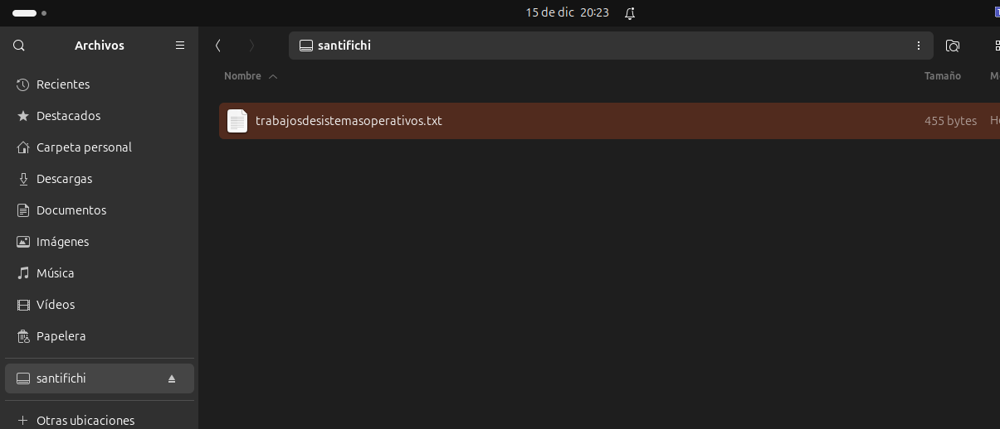
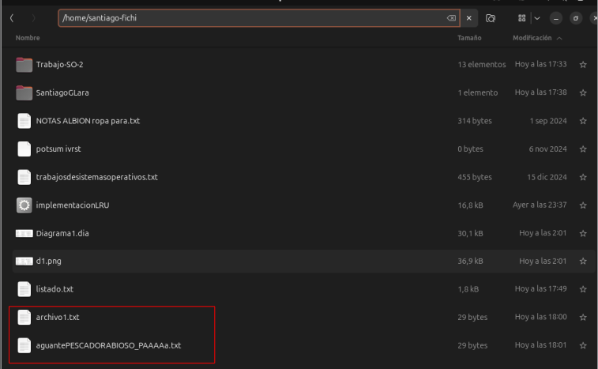
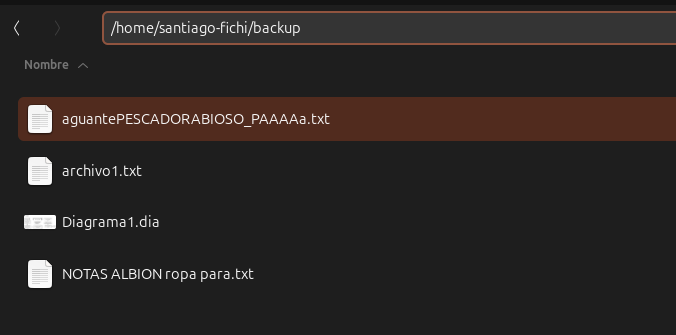
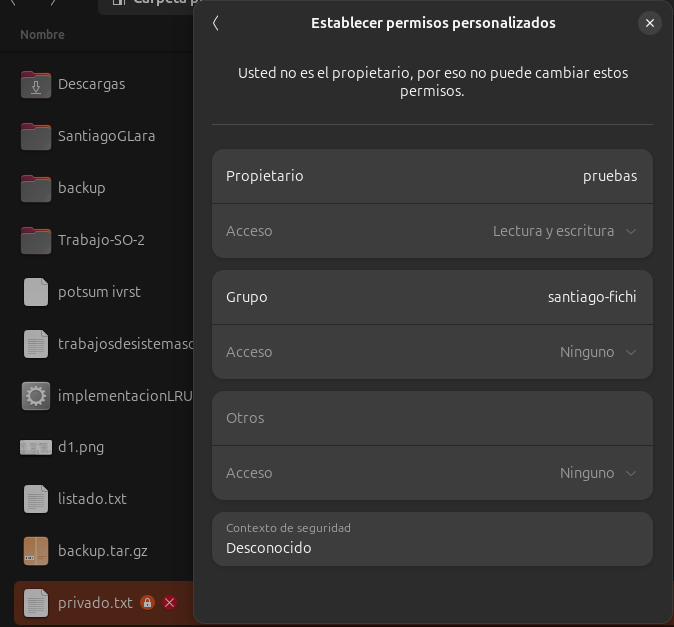

# Comandos de Entrada y Salida, Discos y Archivos

## Ejercicio 1: Montar y Desmontar Discos
buscamos el disco (memoria) con el comando "lsblk"

```bash
sdb           8:16   1  28,9G  0 disk 
└─sdb1        8:17   1  28,9G  0 part /home santiago-fichi/usb
```
montamos el disco
```bash
sudo mount /dev/sdb1 /home/santiago-fichi/usb
```
nos damos cuenta que está mondado porque(en ubuntu) ahora nos aparece el siguiente icono en la barra de tareas<br>
<br>

o tambien, de una forma mas exacta podemos identificar su montaje exitoso con "df -h", en mi caso identificando la memoria /dev/sd1 de 29,1gb, que es mi memoria

```bash
df -h
S.ficheros     Tamaño Usados  Disp Uso% Montado en
tmpfs            1,4G   2,5M  1,4G   1% /run
/dev/sda5        491G    94G  372G  21% /
tmpfs            6,8G    94M  6,7G   2% /dev/shm
tmpfs            5,0M    12K  5,0M   1% /run/lock
efivarfs         148K   133K   11K  93% /sys/firmware/efi/efivars
/dev/sda4        1,1G    43M  1,1G   4% /boot/efi
tmpfs            1,4G   2,6M  1,4G   1% /run/user/1000
/dev/sdb1         29G    66M   29G   1% /home/santiago-fichi/usb

```

copiamos un archivo, meramente a manera de prueba

```bash
cp trabajosdesistemasoperativos.txt /home/santiago-fichi/usb
```
<br>
desmontamos para finalizar
```
sudo umount /dev/sdb1 /home/santiago-fichi/usb
umount: /home/santiago-fichi/usb: no montado.
```
y en efecto, ya no aparece montado

## ejercicio 2: Redirección de Entrada y Salida
ahora, vamos a guardar los archivos del directorio donde nos encontramos en un .txt con el siguiente comando

```bash
ls -l > listado.txt
```
y con el comando `cat listado.txt` mostramos el contenido del .txt, la salida es la siguiente
```bash
santiago-fichi@santiago-inspiron-15-3515:~$ ls -l > listado.txt
santiago-fichi@santiago-inspiron-15-3515:~$ cat listado.txt
total 164
drwxrwxr-x  7 santiago-fichi santiago-fichi  4096 nov 28 22:00 curso-HTML
-rw-rw-r--  1 santiago-fichi santiago-fichi 36868 dic 17 02:01 d1.png
drwxr-xr-x  8 santiago-fichi santiago-fichi  4096 dic 17 01:40 Descargas
-rw-rw-r--  1 santiago-fichi santiago-fichi 30112 dic 17 02:01 Diagrama1.dia
drwxr-xr-x  8 santiago-fichi santiago-fichi  4096 nov 26 14:04 Documentos
drwxr-xr-x  2 santiago-fichi santiago-fichi  4096 ago 24 18:10 Escritorio
drwxr-xr-x  5 santiago-fichi santiago-fichi  4096 dic 15 19:58 Imágenes
-rwxrwxr-x  1 santiago-fichi santiago-fichi 16752 dic 16 23:37 implementacionLRU
drwxrwxr-x  6 santiago-fichi santiago-fichi  4096 dic 10 14:26 kk
-rw-rw-r--  1 santiago-fichi santiago-fichi     0 dic 17 17:44 listado.txt
drwxr-xr-x  2 santiago-fichi santiago-fichi  4096 ago 24 18:10 Música
-rw-rw-r--  1 santiago-fichi santiago-fichi   314 sep  1 17:48 NOTAS ALBION ropa para.txt
drwxr-xr-x  2 santiago-fichi santiago-fichi  4096 ago 24 18:10 Plantillas
-rw-rw-r--  1 santiago-fichi santiago-fichi     0 nov  6 14:10 potsum ivrst
drwxr-xr-x  2 santiago-fichi santiago-fichi  4096 ago 24 18:10 Público
drwxrwxr-x  3 santiago-fichi santiago-fichi  4096 dic 17 17:38 SantiagoGLara
drwx------ 14 santiago-fichi santiago-fichi  4096 dic 10 14:26 snap
drwxrwxr-x  6 santiago-fichi santiago-fichi  4096 dic  1 09:25 SO PRACT
drwxrwxr-x  3 santiago-fichi santiago-fichi  4096 ago 28 17:40 The Escapists
-rw-rw-r--  1 santiago-fichi santiago-fichi   455 dic 15 19:58 trabajosdesistemasoperativos.txt
drwxrwxr-x  5 santiago-fichi santiago-fichi  4096 dic 17 17:33 Trabajo-SO-2
drwxrwxr-x  2 santiago-fichi santiago-fichi  4096 dic 15 19:39 usb
drwxr-xr-x  2 santiago-fichi santiago-fichi  4096 ago 24 18:10 Vídeos

```
ahora, con el siguiente comando le agregamos la fecha en la que hacemos las modificaciones hasta el final del .txt

```bash
date >> listado.txt
```
y volvemos a mostrar el contenido del archivo para comprobar el ultimo cambio
```bash
total 164
drwxrwxr-x  7 santiago-fichi santiago-fichi  4096 nov 28 22:00 curso-HTML
-rw-rw-r--  1 santiago-fichi santiago-fichi 36868 dic 17 02:01 d1.png
drwxr-xr-x  8 santiago-fichi santiago-fichi  4096 dic 17 01:40 Descargas
-rw-rw-r--  1 santiago-fichi santiago-fichi 30112 dic 17 02:01 Diagrama1.dia
drwxr-xr-x  8 santiago-fichi santiago-fichi  4096 nov 26 14:04 Documentos
drwxr-xr-x  2 santiago-fichi santiago-fichi  4096 ago 24 18:10 Escritorio
drwxr-xr-x  5 santiago-fichi santiago-fichi  4096 dic 15 19:58 Imágenes
-rwxrwxr-x  1 santiago-fichi santiago-fichi 16752 dic 16 23:37 implementacionLRU
drwxrwxr-x  6 santiago-fichi santiago-fichi  4096 dic 10 14:26 kk
-rw-rw-r--  1 santiago-fichi santiago-fichi     0 dic 17 17:44 listado.txt
drwxr-xr-x  2 santiago-fichi santiago-fichi  4096 ago 24 18:10 Música
-rw-rw-r--  1 santiago-fichi santiago-fichi   314 sep  1 17:48 NOTAS ALBION ropa para.txt
drwxr-xr-x  2 santiago-fichi santiago-fichi  4096 ago 24 18:10 Plantillas
-rw-rw-r--  1 santiago-fichi santiago-fichi     0 nov  6 14:10 potsum ivrst
drwxr-xr-x  2 santiago-fichi santiago-fichi  4096 ago 24 18:10 Público
drwxrwxr-x  3 santiago-fichi santiago-fichi  4096 dic 17 17:38 SantiagoGLara
drwx------ 14 santiago-fichi santiago-fichi  4096 dic 10 14:26 snap
drwxrwxr-x  6 santiago-fichi santiago-fichi  4096 dic  1 09:25 SO PRACT
drwxrwxr-x  3 santiago-fichi santiago-fichi  4096 ago 28 17:40 The Escapists
-rw-rw-r--  1 santiago-fichi santiago-fichi   455 dic 15 19:58 trabajosdesistemasoperativos.txt
drwxrwxr-x  5 santiago-fichi santiago-fichi  4096 dic 17 17:33 Trabajo-SO-2
drwxrwxr-x  2 santiago-fichi santiago-fichi  4096 dic 15 19:39 usb
drwxr-xr-x  2 santiago-fichi santiago-fichi  4096 ago 24 18:10 Vídeos
mar 17 dic 2024 17:49:18 CST
```
## ejercicio 3: Copiar y Mover Archivos
Crea un archivo de texto llamado `archivo1.txt`: 

```bash
echo "Este es un archivo de prueba" > archivo1.txt
```
copiamos este archivo en cualquier otro directorio, usamos /tmp como ejemplo
```bash
cp archivo1.txt /tmp/
```
ahora renombramos al archivo que está dentro de /tmp
```bash
mv /tmp/archivo1.txt /tmp/aguantePESCADORABIOSO_PAAAAa.txt
```
y ahora lo regresamos al directorio actual
```bash
mv /tmp/aguantePESCADORABIOSO_PAAAAa.txt
```
y en efecto, podemos ver que ambos archivos coexisten en el mismo directorio


## Ejercicio 4: Comprimir y Descomprimir Archivos
primero creamos un directorio con algunas copias de archivos, que es lo que le vamos a hacer backup

ahora con el comando `tar -czvf backup.tar.gz backup/` lo comprimimos en un archivo del tipo tar.gz
```bash
ar -czvf backup.tar.gz backup/
backup/
backup/NOTAS ALBION ropa para.txt
backup/aguantePESCADORABIOSO_PAAAAa.txt
backup/archivo1.txt
backup/Diagrama1.dia
```
y en efecto se comprimió


ahora borramos el directorio original y extraemos a la vez el contenido del comprimido
```bash
tar -xzvf backup.tar.gz
backup/
backup/NOTAS ALBION ropa para.txt
backup/aguantePESCADORABIOSO_PAAAAa.txt
backup/archivo1.txt
backup/Diagrama1.dia
```
## Ejercicio 5: Permisos y Propiedades de Archivos
Creamos un archivo llamado `privado.txt`

```bash
touch privado.txt
```
ahora le cambiamos los permisos, para que solo el propietario del archivo pueda leer y escribir sobre el
```bash
chmod 600 privado.txt
```
ahora le transferimos los permisos a otro usuario, en este caso yo hice otro usuario en mi pc llamado `pruebas`
```bash
sudo chown pruebas privado.txt
[sudo] contraseña para santiago-fichi:
```
de hecho podemos ver que tanto en las propiedades como al ver el archivo en nuestro administrador, nos marca que no tenemos permisos sobre el, ahora que estamos dentro del usuario principal del pc

## Ejercicio 6: Exploración de Dispositivos
primero listamos los dispositivos/discos del pc con `lsblk`
```bash
lsblk
NAME        MAJ:MIN RM   SIZE RO TYPE MOUNTPOINTS
loop0         7:0    0 317,7M  1 loop /snap/code/177
loop1         7:1    0     4K  1 loop /snap/bare/5
loop2         7:2    0 316,5M  1 loop /snap/code/174
loop3         7:3    0 104,2M  1 loop /snap/core/17200
loop4         7:4    0  55,7M  1 loop /snap/core18/2829
loop5         7:5    0  55,4M  1 loop /snap/core18/2846
loop6         7:6    0  63,7M  1 loop /snap/core20/2434
loop7         7:7    0    64M  1 loop /snap/core20/2379
loop8         7:8    0  73,9M  1 loop /snap/core22/1663
loop9         7:9    0  73,9M  1 loop /snap/core22/1722
loop10        7:10   0  66,2M  1 loop /snap/core24/490
loop11        7:11   0  66,2M  1 loop /snap/core24/609
loop12        7:12   0 110,5M  1 loop /snap/discord/218
loop13        7:13   0 115,5M  1 loop /snap/discord/214
loop14        7:14   0 269,6M  1 loop /snap/firefox/4173
loop15        7:15   0  10,7M  1 loop /snap/firmware-updater/127
loop16        7:16   0 210,7M  1 loop /snap/gaming-graphics-core22/166
loop17        7:17   0   193M  1 loop /snap/gaming-graphics-core22/184
loop18        7:18   0 164,8M  1 loop /snap/gnome-3-28-1804/198
loop19        7:19   0 349,7M  1 loop /snap/gnome-3-38-2004/143
loop20        7:20   0 505,1M  1 loop /snap/gnome-42-2204/176
loop21        7:21   0 402,4M  1 loop /snap/gnome-46-2404/42
loop22        7:22   0 406,3M  1 loop /snap/gnome-46-2404/48
loop23        7:23   0  91,7M  1 loop /snap/gtk-common-themes/1535
loop24        7:24   0   3,3M  1 loop /snap/melonds/10
loop25        7:25   0 211,5M  1 loop /snap/mesa-2404/143
loop26        7:26   0  56,1M  1 loop /snap/nightmayr-plasma-integration-5-2004/9
loop27        7:27   0   652K  1 loop /snap/nightmayr-qgnomeplatform-qt5-2004/5
loop28        7:28   0 355,4M  1 loop /snap/nightmayr-qt-5-15-4-2004/33
loop29        7:29   0  84,5M  1 loop /snap/outlook-electron/4
loop30        7:30   0 432,1M  1 loop /snap/qt515-core20/32
loop31        7:31   0 269,8M  1 loop /snap/firefox/4793
loop32        7:32   0  11,1M  1 loop /snap/firmware-updater/147
loop33        7:33   0 308,2M  1 loop /snap/qt5-core20/19
loop34        7:34   0  10,5M  1 loop /snap/snap-store/1173
loop35        7:35   0  38,8M  1 loop /snap/snapd/21759
loop36        7:36   0  44,3M  1 loop /snap/snapd/23258
loop37        7:37   0 438,8M  1 loop /snap/qt515-core20/43
loop38        7:38   0   500K  1 loop /snap/snapd-desktop-integration/178
loop39        7:39   0  10,7M  1 loop /snap/snap-store/1218
loop40        7:40   0   568K  1 loop /snap/snapd-desktop-integration/253
loop41        7:41   0 184,5M  1 loop /snap/spotify/80
loop42        7:42   0 184,8M  1 loop /snap/spotify/81
loop43        7:43   0 200,9M  1 loop /snap/steam/200
loop44        7:44   0 214,9M  1 loop /snap/steam/206
loop45        7:45   0 101,5M  1 loop /snap/teams-for-linux/715
loop46        7:46   0 150,6M  1 loop /snap/thunderbird/585
loop47        7:47   0 101,1M  1 loop /snap/teams-for-linux/724
loop48        7:48   0 150,6M  1 loop /snap/thunderbird/593
loop49        7:49   0   1,8M  1 loop /snap/torrhunt/22
loop50        7:50   0  17,3M  1 loop /snap/whatsie/163
loop51        7:51   0  17,3M  1 loop /snap/whatsie/165
loop52        7:52   0 141,3M  1 loop /snap/mc-installer/638
sda           8:0    0 931,5G  0 disk 
├─sda1        8:1    0    16M  0 part 
├─sda2        8:2    0 429,3G  0 part 
├─sda3        8:3    0   2,1G  0 part 
├─sda4        8:4    0     1G  0 part /boot/efi
└─sda5        8:5    0   499G  0 part /var/snap/firefox/common/host-hunspell
                                      /
sdb           8:16   1  28,9G  0 disk 
└─sdb1        8:17   1  28,9G  0 part /media/santiago-fichi/santifichi
nvme0n1     259:0    0 238,5G  0 disk 
├─nvme0n1p1 259:1    0   300M  0 part 
├─nvme0n1p2 259:2    0   128M  0 part 
├─nvme0n1p3 259:3    0 220,3G  0 part 
├─nvme0n1p4 259:4    0   1,2G  0 part 
├─nvme0n1p5 259:5    0  15,2G  0 part 
└─nvme0n1p6 259:6    0   1,3G  0 part
```
ahora, verificamos el tamaño de algun directorio, en este caso donde montamos la usb en la primera actividad
```bash
du -sh /media/santiago-fichi/santifichi
4,0K	/media/santiago-fichi/santifichi
```
verificamos el uso de disco duro con `df -h`
```bash
df -h
S.ficheros     Tamaño Usados  Disp Uso% Montado en
tmpfs            1,4G   3,2M  1,4G   1% /run
/dev/sda5        491G    95G  371G  21% /
tmpfs            6,8G   185M  6,6G   3% /dev/shm
tmpfs            5,0M    12K  5,0M   1% /run/lock
efivarfs         148K   143K   188 100% /sys/firmware/efi/efivars
/dev/sda4        1,1G    43M  1,1G   4% /boot/efi
tmpfs            1,4G    19M  1,4G   2% /run/user/1000
/dev/sdb1         29G    87M   29G   1% /media/santiago-fichi/santifichi
tmpfs            1,4G   164K  1,4G   1% /run/user/1001
```
## Ejercicio 7: Crear y Formatear Particiones
ahora, listamos los discos en la compu con `sudo fdisk -l` para identificar alguno que no tenga particiones.
```bash
Disco /dev/loop0: 317,69 MiB, 333119488 bytes, 650624 sectores
Unidades: sectores de 1 * 512 = 512 bytes
Tamaño de sector (lógico/físico): 512 bytes / 512 bytes
Tamaño de E/S (mínimo/óptimo): 512 bytes / 512 bytes


Disco /dev/loop1: 4 KiB, 4096 bytes, 8 sectores
Unidades: sectores de 1 * 512 = 512 bytes
Tamaño de sector (lógico/físico): 512 bytes / 512 bytes
Tamaño de E/S (mínimo/óptimo): 512 bytes / 512 bytes


Disco /dev/loop2: 316,46 MiB, 331837440 bytes, 648120 sectores
Unidades: sectores de 1 * 512 = 512 bytes
Tamaño de sector (lógico/físico): 512 bytes / 512 bytes
Tamaño de E/S (mínimo/óptimo): 512 bytes / 512 bytes


Disco /dev/loop3: 104,19 MiB, 109252608 bytes, 213384 sectores
Unidades: sectores de 1 * 512 = 512 bytes
Tamaño de sector (lógico/físico): 512 bytes / 512 bytes
Tamaño de E/S (mínimo/óptimo): 512 bytes / 512 bytes


Disco /dev/loop4: 55,66 MiB, 58363904 bytes, 113992 sectores
Unidades: sectores de 1 * 512 = 512 bytes
Tamaño de sector (lógico/físico): 512 bytes / 512 bytes
Tamaño de E/S (mínimo/óptimo): 512 bytes / 512 bytes


Disco /dev/loop5: 55,36 MiB, 58052608 bytes, 113384 sectores
Unidades: sectores de 1 * 512 = 512 bytes
Tamaño de sector (lógico/físico): 512 bytes / 512 bytes
Tamaño de E/S (mínimo/óptimo): 512 bytes / 512 bytes


Disco /dev/loop6: 63,7 MiB, 66789376 bytes, 130448 sectores
Unidades: sectores de 1 * 512 = 512 bytes
Tamaño de sector (lógico/físico): 512 bytes / 512 bytes
Tamaño de E/S (mínimo/óptimo): 512 bytes / 512 bytes


Disco /dev/loop7: 63,97 MiB, 67080192 bytes, 131016 sectores
Unidades: sectores de 1 * 512 = 512 bytes
Tamaño de sector (lógico/físico): 512 bytes / 512 bytes
Tamaño de E/S (mínimo/óptimo): 512 bytes / 512 bytes


Disco /dev/nvme0n1: 238,47 GiB, 256060514304 bytes, 500118192 sectores
Disk model: KBG50ZNS256G NVMe KIOXIA 256GB          
Unidades: sectores de 1 * 512 = 512 bytes
Tamaño de sector (lógico/físico): 512 bytes / 512 bytes
Tamaño de E/S (mínimo/óptimo): 512 bytes / 512 bytes
Tipo de etiqueta de disco: gpt
Identificador del disco: 1A306B99-4C58-41B5-A2A8-E1432906F07E

Dispositivo     Comienzo     Final  Sectores Tamaño Tipo
/dev/nvme0n1p1      2048    616447    614400   300M Sistema EFI
/dev/nvme0n1p2    616448    878591    262144   128M Reservado para Microsoft
/dev/nvme0n1p3    878592 462946303 462067712 220,3G Datos básicos de Microsoft
/dev/nvme0n1p4 462946304 465410047   2463744   1,2G Entorno de recuperación de W
/dev/nvme0n1p5 465412096 497291263  31879168  15,2G Entorno de recuperación de W
/dev/nvme0n1p6 497293312 500117503   2824192   1,3G Entorno de recuperación de W


Disco /dev/sda: 931,51 GiB, 1000204886016 bytes, 1953525168 sectores
Disk model: ST1000VT001-1RE1
Unidades: sectores de 1 * 512 = 512 bytes
Tamaño de sector (lógico/físico): 512 bytes / 4096 bytes
Tamaño de E/S (mínimo/óptimo): 4096 bytes / 4096 bytes
Tipo de etiqueta de disco: gpt
Identificador del disco: F855A582-A56C-4D89-8925-18088C2F806A

Dispositivo  Comienzo      Final   Sectores Tamaño Tipo
/dev/sda1        2048      34815      32768    16M Reservado para Microsoft
/dev/sda2       34816  900380671  900345856 429,3G Datos básicos de Microsoft
/dev/sda3   900380672  904800255    4419584   2,1G Datos básicos de Microsoft
/dev/sda4   904800256  907001855    2201600     1G Sistema EFI
/dev/sda5   907001856 1953521663 1046519808   499G Sistema de ficheros de Linux


Disco /dev/loop8: 73,88 MiB, 77463552 bytes, 151296 sectores
Unidades: sectores de 1 * 512 = 512 bytes
Tamaño de sector (lógico/físico): 512 bytes / 512 bytes
Tamaño de E/S (mínimo/óptimo): 512 bytes / 512 bytes


Disco /dev/loop9: 73,87 MiB, 77459456 bytes, 151288 sectores
Unidades: sectores de 1 * 512 = 512 bytes
Tamaño de sector (lógico/físico): 512 bytes / 512 bytes
Tamaño de E/S (mínimo/óptimo): 512 bytes / 512 bytes


Disco /dev/loop10: 66,17 MiB, 69382144 bytes, 135512 sectores
Unidades: sectores de 1 * 512 = 512 bytes
Tamaño de sector (lógico/físico): 512 bytes / 512 bytes
Tamaño de E/S (mínimo/óptimo): 512 bytes / 512 bytes


Disco /dev/loop11: 66,17 MiB, 69382144 bytes, 135512 sectores
Unidades: sectores de 1 * 512 = 512 bytes
Tamaño de sector (lógico/físico): 512 bytes / 512 bytes
Tamaño de E/S (mínimo/óptimo): 512 bytes / 512 bytes


Disco /dev/loop12: 110,53 MiB, 115896320 bytes, 226360 sectores
Unidades: sectores de 1 * 512 = 512 bytes
Tamaño de sector (lógico/físico): 512 bytes / 512 bytes
Tamaño de E/S (mínimo/óptimo): 512 bytes / 512 bytes


Disco /dev/loop13: 115,5 MiB, 121114624 bytes, 236552 sectores
Unidades: sectores de 1 * 512 = 512 bytes
Tamaño de sector (lógico/físico): 512 bytes / 512 bytes
Tamaño de E/S (mínimo/óptimo): 512 bytes / 512 bytes


Disco /dev/loop14: 269,63 MiB, 282722304 bytes, 552192 sectores
Unidades: sectores de 1 * 512 = 512 bytes
Tamaño de sector (lógico/físico): 512 bytes / 512 bytes
Tamaño de E/S (mínimo/óptimo): 512 bytes / 512 bytes


Disco /dev/loop15: 10,72 MiB, 11239424 bytes, 21952 sectores
Unidades: sectores de 1 * 512 = 512 bytes
Tamaño de sector (lógico/físico): 512 bytes / 512 bytes
Tamaño de E/S (mínimo/óptimo): 512 bytes / 512 bytes


Disco /dev/loop16: 210,74 MiB, 220975104 bytes, 431592 sectores
Unidades: sectores de 1 * 512 = 512 bytes
Tamaño de sector (lógico/físico): 512 bytes / 512 bytes
Tamaño de E/S (mínimo/óptimo): 512 bytes / 512 bytes


Disco /dev/loop17: 192,98 MiB, 202350592 bytes, 395216 sectores
Unidades: sectores de 1 * 512 = 512 bytes
Tamaño de sector (lógico/físico): 512 bytes / 512 bytes
Tamaño de E/S (mínimo/óptimo): 512 bytes / 512 bytes


Disco /dev/loop18: 164,82 MiB, 172830720 bytes, 337560 sectores
Unidades: sectores de 1 * 512 = 512 bytes
Tamaño de sector (lógico/físico): 512 bytes / 512 bytes
Tamaño de E/S (mínimo/óptimo): 512 bytes / 512 bytes


Disco /dev/loop19: 349,7 MiB, 366682112 bytes, 716176 sectores
Unidades: sectores de 1 * 512 = 512 bytes
Tamaño de sector (lógico/físico): 512 bytes / 512 bytes
Tamaño de E/S (mínimo/óptimo): 512 bytes / 512 bytes


Disco /dev/loop20: 505,09 MiB, 529625088 bytes, 1034424 sectores
Unidades: sectores de 1 * 512 = 512 bytes
Tamaño de sector (lógico/físico): 512 bytes / 512 bytes
Tamaño de E/S (mínimo/óptimo): 512 bytes / 512 bytes


Disco /dev/loop21: 402,36 MiB, 421908480 bytes, 824040 sectores
Unidades: sectores de 1 * 512 = 512 bytes
Tamaño de sector (lógico/físico): 512 bytes / 512 bytes
Tamaño de E/S (mínimo/óptimo): 512 bytes / 512 bytes


Disco /dev/loop22: 406,26 MiB, 425996288 bytes, 832024 sectores
Unidades: sectores de 1 * 512 = 512 bytes
Tamaño de sector (lógico/físico): 512 bytes / 512 bytes
Tamaño de E/S (mínimo/óptimo): 512 bytes / 512 bytes


Disco /dev/loop23: 91,69 MiB, 96141312 bytes, 187776 sectores
Unidades: sectores de 1 * 512 = 512 bytes
Tamaño de sector (lógico/físico): 512 bytes / 512 bytes
Tamaño de E/S (mínimo/óptimo): 512 bytes / 512 bytes


Disco /dev/loop24: 3,27 MiB, 3428352 bytes, 6696 sectores
Unidades: sectores de 1 * 512 = 512 bytes
Tamaño de sector (lógico/físico): 512 bytes / 512 bytes
Tamaño de E/S (mínimo/óptimo): 512 bytes / 512 bytes


Disco /dev/loop25: 211,49 MiB, 221761536 bytes, 433128 sectores
Unidades: sectores de 1 * 512 = 512 bytes
Tamaño de sector (lógico/físico): 512 bytes / 512 bytes
Tamaño de E/S (mínimo/óptimo): 512 bytes / 512 bytes


Disco /dev/loop26: 56,12 MiB, 58847232 bytes, 114936 sectores
Unidades: sectores de 1 * 512 = 512 bytes
Tamaño de sector (lógico/físico): 512 bytes / 512 bytes
Tamaño de E/S (mínimo/óptimo): 512 bytes / 512 bytes


Disco /dev/loop27: 652 KiB, 667648 bytes, 1304 sectores
Unidades: sectores de 1 * 512 = 512 bytes
Tamaño de sector (lógico/físico): 512 bytes / 512 bytes
Tamaño de E/S (mínimo/óptimo): 512 bytes / 512 bytes


Disco /dev/loop28: 355,43 MiB, 372695040 bytes, 727920 sectores
Unidades: sectores de 1 * 512 = 512 bytes
Tamaño de sector (lógico/físico): 512 bytes / 512 bytes
Tamaño de E/S (mínimo/óptimo): 512 bytes / 512 bytes


Disco /dev/loop29: 84,47 MiB, 88576000 bytes, 173000 sectores
Unidades: sectores de 1 * 512 = 512 bytes
Tamaño de sector (lógico/físico): 512 bytes / 512 bytes
Tamaño de E/S (mínimo/óptimo): 512 bytes / 512 bytes


Disco /dev/loop30: 432,07 MiB, 453062656 bytes, 884888 sectores
Unidades: sectores de 1 * 512 = 512 bytes
Tamaño de sector (lógico/físico): 512 bytes / 512 bytes
Tamaño de E/S (mínimo/óptimo): 512 bytes / 512 bytes


Disco /dev/loop31: 269,77 MiB, 282873856 bytes, 552488 sectores
Unidades: sectores de 1 * 512 = 512 bytes
Tamaño de sector (lógico/físico): 512 bytes / 512 bytes
Tamaño de E/S (mínimo/óptimo): 512 bytes / 512 bytes


Disco /dev/loop32: 11,11 MiB, 11649024 bytes, 22752 sectores
Unidades: sectores de 1 * 512 = 512 bytes
Tamaño de sector (lógico/físico): 512 bytes / 512 bytes
Tamaño de E/S (mínimo/óptimo): 512 bytes / 512 bytes


Disco /dev/loop33: 308,21 MiB, 323186688 bytes, 631224 sectores
Unidades: sectores de 1 * 512 = 512 bytes
Tamaño de sector (lógico/físico): 512 bytes / 512 bytes
Tamaño de E/S (mínimo/óptimo): 512 bytes / 512 bytes


Disco /dev/loop34: 10,54 MiB, 11051008 bytes, 21584 sectores
Unidades: sectores de 1 * 512 = 512 bytes
Tamaño de sector (lógico/físico): 512 bytes / 512 bytes
Tamaño de E/S (mínimo/óptimo): 512 bytes / 512 bytes


Disco /dev/loop35: 38,83 MiB, 40714240 bytes, 79520 sectores
Unidades: sectores de 1 * 512 = 512 bytes
Tamaño de sector (lógico/físico): 512 bytes / 512 bytes
Tamaño de E/S (mínimo/óptimo): 512 bytes / 512 bytes


Disco /dev/loop36: 44,3 MiB, 46448640 bytes, 90720 sectores
Unidades: sectores de 1 * 512 = 512 bytes
Tamaño de sector (lógico/físico): 512 bytes / 512 bytes
Tamaño de E/S (mínimo/óptimo): 512 bytes / 512 bytes


Disco /dev/loop37: 438,82 MiB, 460136448 bytes, 898704 sectores
Unidades: sectores de 1 * 512 = 512 bytes
Tamaño de sector (lógico/físico): 512 bytes / 512 bytes
Tamaño de E/S (mínimo/óptimo): 512 bytes / 512 bytes


Disco /dev/loop38: 500 KiB, 512000 bytes, 1000 sectores
Unidades: sectores de 1 * 512 = 512 bytes
Tamaño de sector (lógico/físico): 512 bytes / 512 bytes
Tamaño de E/S (mínimo/óptimo): 512 bytes / 512 bytes


Disco /dev/loop39: 10,67 MiB, 11186176 bytes, 21848 sectores
Unidades: sectores de 1 * 512 = 512 bytes
Tamaño de sector (lógico/físico): 512 bytes / 512 bytes
Tamaño de E/S (mínimo/óptimo): 512 bytes / 512 bytes


Disco /dev/loop40: 568 KiB, 581632 bytes, 1136 sectores
Unidades: sectores de 1 * 512 = 512 bytes
Tamaño de sector (lógico/físico): 512 bytes / 512 bytes
Tamaño de E/S (mínimo/óptimo): 512 bytes / 512 bytes


Disco /dev/loop41: 184,51 MiB, 193474560 bytes, 377880 sectores
Unidades: sectores de 1 * 512 = 512 bytes
Tamaño de sector (lógico/físico): 512 bytes / 512 bytes
Tamaño de E/S (mínimo/óptimo): 512 bytes / 512 bytes


Disco /dev/loop42: 184,79 MiB, 193761280 bytes, 378440 sectores
Unidades: sectores de 1 * 512 = 512 bytes
Tamaño de sector (lógico/físico): 512 bytes / 512 bytes
Tamaño de E/S (mínimo/óptimo): 512 bytes / 512 bytes


Disco /dev/loop43: 200,95 MiB, 210706432 bytes, 411536 sectores
Unidades: sectores de 1 * 512 = 512 bytes
Tamaño de sector (lógico/físico): 512 bytes / 512 bytes
Tamaño de E/S (mínimo/óptimo): 512 bytes / 512 bytes


Disco /dev/loop44: 214,9 MiB, 225341440 bytes, 440120 sectores
Unidades: sectores de 1 * 512 = 512 bytes
Tamaño de sector (lógico/físico): 512 bytes / 512 bytes
Tamaño de E/S (mínimo/óptimo): 512 bytes / 512 bytes


Disco /dev/loop45: 101,53 MiB, 106459136 bytes, 207928 sectores
Unidades: sectores de 1 * 512 = 512 bytes
Tamaño de sector (lógico/físico): 512 bytes / 512 bytes
Tamaño de E/S (mínimo/óptimo): 512 bytes / 512 bytes


Disco /dev/loop46: 150,55 MiB, 157863936 bytes, 308328 sectores
Unidades: sectores de 1 * 512 = 512 bytes
Tamaño de sector (lógico/físico): 512 bytes / 512 bytes
Tamaño de E/S (mínimo/óptimo): 512 bytes / 512 bytes


Disco /dev/loop47: 101,14 MiB, 106053632 bytes, 207136 sectores
Unidades: sectores de 1 * 512 = 512 bytes
Tamaño de sector (lógico/físico): 512 bytes / 512 bytes
Tamaño de E/S (mínimo/óptimo): 512 bytes / 512 bytes


Disco /dev/loop48: 150,55 MiB, 157868032 bytes, 308336 sectores
Unidades: sectores de 1 * 512 = 512 bytes
Tamaño de sector (lógico/físico): 512 bytes / 512 bytes
Tamaño de E/S (mínimo/óptimo): 512 bytes / 512 bytes


Disco /dev/loop49: 1,77 MiB, 1855488 bytes, 3624 sectores
Unidades: sectores de 1 * 512 = 512 bytes
Tamaño de sector (lógico/físico): 512 bytes / 512 bytes
Tamaño de E/S (mínimo/óptimo): 512 bytes / 512 bytes


Disco /dev/loop50: 17,27 MiB, 18108416 bytes, 35368 sectores
Unidades: sectores de 1 * 512 = 512 bytes
Tamaño de sector (lógico/físico): 512 bytes / 512 bytes
Tamaño de E/S (mínimo/óptimo): 512 bytes / 512 bytes


Disco /dev/loop51: 17,27 MiB, 18108416 bytes, 35368 sectores
Unidades: sectores de 1 * 512 = 512 bytes
Tamaño de sector (lógico/físico): 512 bytes / 512 bytes
Tamaño de E/S (mínimo/óptimo): 512 bytes / 512 bytes


Disco /dev/loop52: 141,3 MiB, 148164608 bytes, 289384 sectores
Unidades: sectores de 1 * 512 = 512 bytes
Tamaño de sector (lógico/físico): 512 bytes / 512 bytes
Tamaño de E/S (mínimo/óptimo): 512 bytes / 512 bytes


Disco /dev/sdb: 28,91 GiB, 31042043904 bytes, 60628992 sectores
Disk model: USB DISK 2.0    
Unidades: sectores de 1 * 512 = 512 bytes
Tamaño de sector (lógico/físico): 512 bytes / 512 bytes
Tamaño de E/S (mínimo/óptimo): 512 bytes / 512 bytes
Tipo de etiqueta de disco: dos
Identificador del disco: 0x8fe89b7b

Dispositivo Inicio Comienzo    Final Sectores Tamaño Id Tipo
/dev/sdb1              2048 60628991 60626944  28,9G  7 HPFS/NTFS/exFAT
```
en este caso, por seguridad utilicaré la usb  `/dev/sdb`, uso  `fdisk` para particionarlo 
```bash
sudo fdisk /dev/sdb
Bienvenido a fdisk (util-linux 2.39.3).
Los cambios solo permanecerán en la memoria, hasta que decida escribirlos.
Tenga cuidado antes de utilizar la orden de escritura.


Orden (m para obtener ayuda): m

Ayuda:

  DOS (MBR)
   a   conmuta el indicador de iniciable
   b   modifica la etiqueta de disco BSD anidada
   c   conmuta el indicador de compatibilidad con DOS

  General
   d   borra una partición
   F   lista el espacio libre no particionado
   l   lista los tipos de particiones conocidos
   n   añade una nueva partición
   p   muestra la tabla de particiones
   t   cambia el tipo de una partición
   v   verifica la tabla de particiones
   i   imprime información sobre una partición

  Miscelánea
   m   muestra este menú
   u   cambia las unidades de visualización/entrada
   x   funciones adicionales (sólo para usuarios avanzados)

  Script
   I   carga la estructura del disco de un fichero de script sfdisk
   O   vuelca la estructura del disco a un fichero de script sfdisk

  Guardar y Salir
   w   escribe la tabla en el disco y sale
   q   sale sin guardar los cambios

  Crea una nueva etiqueta
   g   crea una nueva tabla de particiones GPT vacía
   G   crea una nueva tabla de particiones SGI (IRIX) vacía
   o   create a new empty MBR (DOS) partition table
   s   crea una nueva tabla de particiones Sun vacía


Orden (m para obtener ayuda): n
Tipo de partición
   p   primaria (0 primary, 0 extended, 4 free)
   e   extendida (contenedor para particiones lógicas)
Seleccionar (valor predeterminado p): p
Número de partición (1-4, valor predeterminado 1): 1
Primer sector (2048-60628991, valor predeterminado 2048): 
Last sector, +/-sectors or +/-size{K,M,G,T,P} (2048-60628991, valor predeterminado 60628991): 

Crea una nueva partición 1 de tipo 'Linux' y de tamaño 28,9 GiB.
Partición #1: contiene un ntfs en la firma.

¿Desea eliminar la firma? [S]í/[N]o: s

La firma se borrará mediante una orden de escritura.

Orden (m para obtener ayuda): m

Ayuda:

  DOS (MBR)
   a   conmuta el indicador de iniciable
   b   modifica la etiqueta de disco BSD anidada
   c   conmuta el indicador de compatibilidad con DOS

  General
   d   borra una partición
   F   lista el espacio libre no particionado
   l   lista los tipos de particiones conocidos
   n   añade una nueva partición
   p   muestra la tabla de particiones
   t   cambia el tipo de una partición
   v   verifica la tabla de particiones
   i   imprime información sobre una partición

  Miscelánea
   m   muestra este menú
   u   cambia las unidades de visualización/entrada
   x   funciones adicionales (sólo para usuarios avanzados)

  Script
   I   carga la estructura del disco de un fichero de script sfdisk
   O   vuelca la estructura del disco a un fichero de script sfdisk

  Guardar y Salir
   w   escribe la tabla en el disco y sale
   q   sale sin guardar los cambios

  Crea una nueva etiqueta
   g   crea una nueva tabla de particiones GPT vacía
   G   crea una nueva tabla de particiones SGI (IRIX) vacía
   o   create a new empty MBR (DOS) partition table
   s   crea una nueva tabla de particiones Sun vacía


Orden (m para obtener ayuda): w
Se ha modificado la tabla de particiones.
Llamando a ioctl() para volver a leer la tabla de particiones.
Se están sincronizando los discos.
```
ahora lo formateamos como ext4, que es exclusivo de linux
```bash
sudo mkfs.ext4 /dev/sdb1
mke2fs 1.47.0 (5-Feb-2023)
Se está creando un sistema de ficheros con 7578368 bloques de 4k y 1896832 nodos-i
UUID del sistema de ficheros: 58acf9a1-2267-40f4-ae12-68602c713ae2
Respaldos del superbloque guardados en los bloques: 
	32768, 98304, 163840, 229376, 294912, 819200, 884736, 1605632, 2654208, 
	4096000

Reservando las tablas de grupo: hecho                            
Escribiendo las tablas de nodos-i: hecho                            
Creando el fichero de transacciones (32768 bloques): hecho
Escribiendo superbloques y la información contable del sistema de archivos:   0/hecho  
```
ahora la montamos sobre un directorio cualquiera, y le añadimos algun archivo indistinto
```bash
sudo mount /dev/sdb1 /home/santiago-fichi/usb
sudo echo "Prueba de escritura" > /home/santiago-fichi/usb/test.txt
```