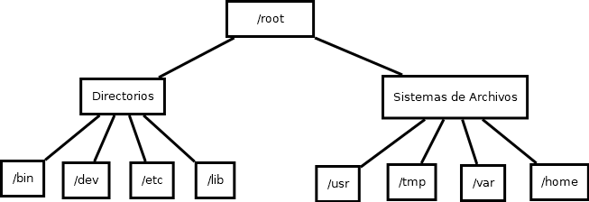
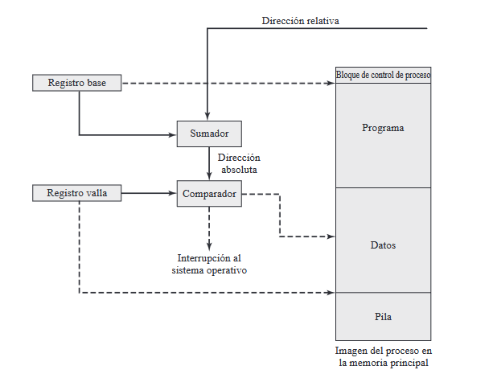
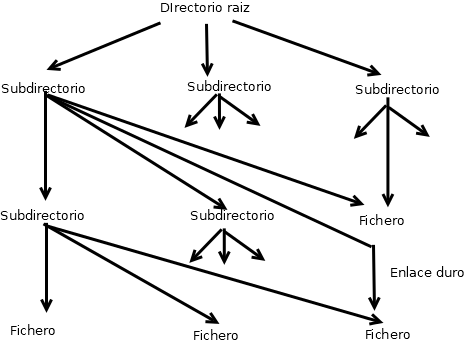
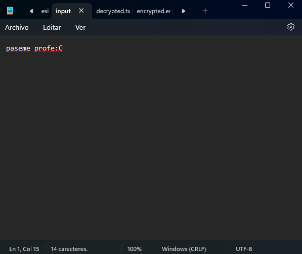
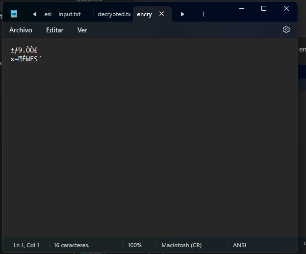
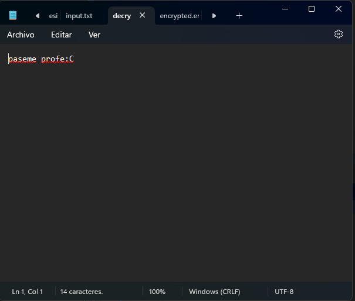

## Sistemas de Archivos

### Ejercicio 1: Concepto y noción de archivo real y virtual

**Descripción:**

- Define los conceptos de archivo real y archivo virtual y explica sus diferencias.
- Identifica ejemplos prácticos de cada tipo en sistemas operativos actuales.

**Tareas:**

- **Define el concepto de archivo real y archivo virtual.** <br>
**archivo real:** es un archivo que contiene programas, datos o cualquier otro elemento. 
Un archivo se muestra de manera real, en la información del espacio que ocupa en un disco duro o sistema de almacenamiento, en otras palabras, su tamaño es en bytes(o su escala).
<br>
**archivo virtual:** es un archivo temporal utilizado por los procesos mientras estos lo necesitan, se crean durante la ejecucion de sistema para almacenar, intercambiar e organizar informacion. Terminan cuando el proceso que los necesita acaba.
- **Proporciona ejemplos de cómo los sistemas operativos manejan archivos reales y virtuales.**<br>
en ambos, un ejemplo de como se manejan los archivos reales es la forma "jerarquica" en la que podemos ver como están almacenados, ya sea en NFTS en windows o exfat4 en linux<br>
en caso de los archivos virtuales, windows tiene el ejemplo de los archivos de paginación, que son archivos temporales que contienen partes de la memoria RAM que no se están utilizando activamente. Permiten que el sistema operativo pueda utilizar más memoria de la que físicamente tiene instalada. Con ubuntu podrían ser las búsquedas virtuales, donde el sistema de archivos virtual (VFS) de Linux permite unificar el acceso a diferentes tipos de dispositivos de almacenamiento, como discos duros, unidades de red y dispositivos USB.
- **Explica un caso práctico donde un archivo virtual sea más útil que un archivo real.**<br>
por ejemplo, cuando necesitamos la informacion en tiempo real de los procesos en ejecucion del sistema y todo lo referente a ellos, basicamente como la que nos da el administrador de tareas del sistema operativo, en ese caso los archvios virtuales nos ayudan a almacenar temporalmente esa informacion. De hacerlo con archivos reales, sería mas tardado y costoso, al implicar demasiadas lecturas y escrituras, ademas implicando un desgaste excesivo sobre el dispositivo de almacenamiento
---

### Ejercicio 2: Componentes de un sistema de archivos

**Descripción:**

- Investiga los componentes principales de un sistema de archivos y compáralos entre dos sistemas operativos, como Linux y Windows.

**Tareas:**

- **Identifica los componentes clave de un sistema de archivos (por ejemplo, metadatos, tablas de asignación, etc.).**<br>
1. superbloque: contiene informacion del sistema de archivos en general, como su tamaño, numero de bloques, ubicacion del sistema de datos, entre otros datos.
2. bloques de datos: guardan los datos reales de los archivos
3. inodos: tambien conocidos como nodos indice, contienen la informacion de los archivos, como su propietario, tamaño, permisos.
4. directorios: Son estructuras que organizan archivos en una jerarquía. Cada directorio puede contener archivos y subdirectorios.
Los directorios son gestionados por tablas o estructuras específicas que almacenan los nombres de los archivos y referencias a sus inodos.
5. tablas de asignacion: son estructuras de datos que se encargan de rastrear cómo se asigna el espacio de almacenamiento físico del disco a los archivos y directorios.
6. registros de journaling: registro de cambios, evita la corrupcion de los archivos
7. metadatos: nformación sobre cada archivo y directorio como el nombre del archivo, fecha de creación, modificación y acceso, Permisos de acceso, propietario, tamaño y grupo.
  

- **Crea un cuadro comparativo de cómo estos componentes funcionan en sistemas como EXT4 y NTFS.**<br>

### Comparación entre ext4 y NTFS

| **Componente**               | **ext4 (Linux)**                                                                 | **NTFS (Windows)**                                                                   |
|-------------------------------|----------------------------------------------------------------------------------|-------------------------------------------------------------------------------------|
| **Superbloque**              | Guarda información sobre el sistema de archivos (tamaño, estado, bloques). Tiene copias redundantes para seguridad. | Lo equivalente es la "Master File Table (MFT)", que guarda metadatos de todos los archivos y tiene copias de respaldo. |
| **Bloques de datos**         | Tamaño personalizable (1 KB, 2 KB, 4 KB, etc.) para almacenar los datos reales. Se agrupan en grupos para eficiencia. | Usa clústeres (grupos de sectores). El tamaño se ajusta automáticamente según el disco. |
| **Inodos**                   | Cada archivo tiene un inodo con su información (permisos, dueño, ubicación de datos). | NTFS no usa inodos. En su lugar, toda la información está en la MFT. |
| **Directorios**              | Organizados en una jerarquía con referencias a los inodos correspondientes. | También son jerárquicos, pero las carpetas son entradas en la MFT que apuntan a otros archivos o carpetas. |
| **Metadatos**                | Incluyen el nombre, tamaño, permisos y fechas, almacenados en los inodos. | Centralizados en la MFT, con soporte adicional para datos secundarios (streams). |
| **Gestión de espacio libre** | Usa mapas de bits para rastrear bloques libres y ocupados. | También usa un mapa de bits para identificar clústeres libres. |
| **Controladores de almacenamiento** | Compatible con HDD, SSD y almacenamiento en red. Soporta journaling para evitar corrupción. | Optimizado para discos locales y tiene soporte para compresión y cifrado. |
| **Caché de sistema de archivos** | Usa memoria RAM para acelerar el acceso a datos usados frecuentemente. | Similar, utiliza caché para mejorar el rendimiento en acceso a datos. |
| **Control de acceso y seguridad** | Basado en permisos POSIX y listas de control de acceso (ACL). | Usa listas de control de acceso (ACL) integradas con permisos de Windows. |
| **Registros de journaling**  | Lleva un registro de cambios para evitar corrupción en caso de fallos. | También tiene journaling avanzado con registro detallado de transacciones. |
| **Compatibilidad**           | Es nativo de Linux, pero se puede leer en otros sistemas con herramientas especiales. | Es nativo de Windows, pero puede ser usado en Linux o macOS con programas adicionales. |


- **Describe las ventajas y desventajas de cada sistema basado en sus componentes.**<br>
   ### Comparación entre NTFS y ext4

| **Característica**         | **NTFS**                                                                 | **ext4**                                                      |
|-----------------------------|--------------------------------------------------------------------------|---------------------------------------------------------------|
| **Compatibilidad**          | Nativo en Windows, funcional en Linux/macOS con herramientas adicionales. | Nativo en Linux, funcional en Windows/macOS con herramientas. |
| **Rendimiento**             | Bueno para archivos grandes, pero más lento con fragmentación.           | Excelente para archivos pequeños y muchos directorios.        |
| **Fragmentación**           | Propenso a fragmentarse.                                                | Muy resistente a la fragmentación.                           |
| **Funciones avanzadas**     | Compresión, cifrado, cuotas de disco, flujos de datos alternativos.      | Carece de estas funciones.                                    |
| **Recuperación de datos**   | Buena, gracias al journaling avanzado y la MFT.                         | Limitada, requiere herramientas específicas.                  |


---

### Ejercicio 3: Organización lógica y física de archivos

**Descripción:**

- Crea un esquema que muestre la organización lógica y física de un sistema de archivos. Explica cómo se relacionan las estructuras lógicas con las físicas en el disco.

**Tareas:**

- Diseña un árbol jerárquico que represente la organización lógica de directorios y subdirectorios.

tambien podemos apreciar un ejemplo del libro de Antonia Estero botaro y Juan José dominguez Jimenez "sistemas operativos, conceptos fundamentales"

- **Explica cómo se traduce la dirección lógica a la dirección física en el disco.**<br>
Cuando un proceso entra en el estado de ejecución, un registro especial del procesador, a menudo llamado **registro base**, se carga con la dirección inicial del programa en la memoria principal. Además, existe un registro llamado **registro límite** o "valla", que marca la posición final de la memoria asignada al programa. Estos valores se configuran cuando el programa se carga en la memoria o cuando la imagen del proceso se transfiere a ella.
<br>Durante la ejecución del proceso, se utilizan **direcciones relativas**. Estas incluyen las direcciones almacenadas en el registro de instrucciones, las direcciones de saltos o llamadas (instrucciones `call`), y las direcciones de datos especificadas en instrucciones de carga y almacenamiento. El procesador procesa estas direcciones relativas en dos pasos:
1. **Cálculo de la dirección absoluta**: Se suma el valor del registro base a la dirección relativa para obtener una dirección absoluta.
2. **Verificación de límites**: La dirección absoluta se compara con el valor del registro límite. Si la dirección está dentro del rango permitido, la instrucción puede ejecutarse. Si no, se genera una interrupción, que el sistema operativo debe gestionar adecuadamente.
<br>
Este mecanismo asegura que el proceso no acceda a regiones de memoria fuera de las asignadas, protegiendo así la estabilidad del sistema.
podemos verlo en la siguiente imagen:


- Proporciona un ejemplo práctico de cómo un archivo se almacena físicamente.
Creación del archivo: Supongamos que creas documento.txt, un archivo de 5 KB.

División en bloques: El archivo se divide en partes según el tamaño de los clusters. Si cada cluster es de 4 KB: Los primeros 4 KB ocupan un cluster. El último 1 KB ocupa otro cluster (aunque deja 3 KB vacíos por el tamaño fijo).

Asignación de clusters: El sistema de archivos encuentra clusters libres en el disco. Por ejemplo: el archivo se almacena en los clusters 1000 y 2000.

Registro en la tabla del sistema de archivos:
 Se guarda en una tabla (como la MFT en NTFS) la información del archivo: nombre, tamaño, y los clusters asignados (1000 y 2000).

---

### Ejercicio 4: Mecanismos de acceso a los archivos

**Descripción:**

- Simula diferentes mecanismos de acceso a archivos (secuencial, directo e indexado) en un entorno práctico.

**Tareas:**

1. **Define los diferentes mecanismos de acceso.**
   - acceso secuencial: visto principalmente en sistemas operativos viejos, los procesos podian acceder a los bytes/informacion de un archivo de forma ordenada, sin poder saltar y leerlos de manera desordenada. Eran utiles porque concordaban y cumplian bien la funcion para el metodo de almacenar la informacion de aquel entonces, que era con cintas magneticas
   - acceso directo: el equipo necesita forzosamente un controlador de DMA(Direct Memory Access) por dispositivo, aunque lo comun es que un solo controlador administre las transferencias de informacion a varios dispositivos. DMA funciona de la siguiente forma: 
      1. la cpu programa al controlador DMA
      2. El controlador solicita la transferencia a la memoria
      3. el controlador del disco transfiere los datos a la memoria principal
      4. cuando la escritura se ha completado, el controlador del disco le avisa al DMA por medio de una señal de reconocimiento
      5. el controlador de DMA incrementa la dirección de memoria a utilizar y disminuye la cuenta de bytes. Si la cuenta de bytes es aún mayor que 0, se repiten los pasos del 2 al 4 hasta que la cuenta llega a 0. 
      6. cuando llega a 0, el DMA interrumpe a la cpu para comunicarle que la transferencia se ha completado
   - acceso indexado: permite buscar archivos sin orden alguno, utiliza listas que contengan un campo clave o mas datos del archivo, dicha tabla se utiliza en busquedas para encontrar cierta posicion o valor de un archivo

2. **Escribe un pseudocódigo que muestre cómo acceder a:**
   - **Un archivo secuencialmente.**
   ```
   Abrir archivo
   línea_actual = ""
   Mientras NO fin_del_archivo(archivo):
      línea_actual = Leer línea del archivo
      Procesar(línea_actual)
   Cerrar archivo
   ```
   - **Un archivo directamente mediante su posición.**
   ```
   Configurar DMA con dirección de memoria inicial y cuenta de bytes
   Mientras cuenta_de_bytes > 0:
      Solicitar transferencia al controlador del disco
      Transferir datos desde el disco a la dirección de memoria actual
      Esperar señal de reconocimiento del controlador del disco
      Incrementar dirección de memoria
      Decrementar cuenta_de_bytes
   Interrumpir CPU para indicar que la transferencia ha finalizado

   ```
   - **Un archivo utilizando un índice.**
   ```
   Abrir archivo 
   cargar tabla de índices en memoria
   Mientras NO fin_de_lista_de_indices:
      índice_actual = Leer siguiente índice de la tabla
      Posicionar puntero del archivo en índice_actual
      dato = Leer datos en índice_actual
      Procesar(dato)
   Cerrar archivo
   ```
3. Compara las ventajas de cada mecanismo dependiendo del caso de uso.

| Método de Acceso    | Ventajas                                         | Desventajas                                    |
|---------------------|--------------------------------------------------|------------------------------------------------|
| **Acceso Secuencial** | - Simple de implementar                         | - Lento al acceder a grandes cantidades de datos sin orden específico |
|                     | - Requiere poca memoria                         | - Solo permite leer en orden, sin saltos       |
|                     | - Adecuado para procesos de lectura lineales     | - No eficiente para búsquedas rápidas          |
| **Acceso Directo**    | - Acceso rápido a cualquier parte del archivo   | - Requiere más memoria para gestionar punteros |
|                     | - Permite saltar directamente a la ubicación deseada | - Puede ser más complejo de implementar       |
|                     | - Eficiente en archivos grandes                  | - No es adecuado para archivos pequeños       |
| **Acceso Indexado**   | - Acceso rápido mediante índices                | - Requiere mantener y actualizar una tabla de índices |
|                     | - Ideal para búsquedas rápidas                  | - Puede ser más lento si los índices están desordenados |
|                     | - Más eficiente que el acceso secuencial y directo en algunas situaciones | - Requiere más espacio de almacenamiento     |


---

### Ejercicio 5: Modelo jerárquico y mecanismos de recuperación en caso de falla

**Descripción:**

- Diseña una estructura jerárquica para un sistema de archivos y simula un escenario de falla en el sistema. Describe cómo recuperar los datos utilizando mecanismos de recuperación.

**Tareas:**

- Diseña un modelo jerárquico para un sistema de archivos con al menos tres niveles de directorios.

- Simula una falla en un directorio específico y describe los pasos necesarios para recuperarlo.
   1. Verificar el Daño en el Directorio
   2. Verificar la Integridad del Sistema de Archivos
   3. Comprobar los Backups Disponibles
   4. Restaurar desde un Backup
   5. Verificar la Restauración
   6. Comprobar el Estado General del Sistema de Archivos
   7. Establecer un Plan de Copias de Seguridad Regular
- **Explica el concepto de protección basada en el lenguaje.**<br>
permite establecer, de manera general, las reglas sobre cómo se deben asignar y utilizar los recursos. Estas reglas pueden variar según la aplicación y cambiar con el tiempo. Por esta razón, la protección ya no es algo que solo le corresponde al diseñador del sistema operativo, sino que también debe ser una herramienta que los desarrolladores de aplicaciones puedan usar para proteger los recursos dentro de sus programas frente a errores o interferencias. Es aquí donde los lenguajes de programación tienen un papel importante. Especificar cómo se debe controlar el acceso a un recurso compartido en un sistema significa hacer una declaración sobre ese recurso, y este tipo de declaración puede añadirse al lenguaje mediante una extensión en su sistema de tipos.
- **Proporciona un ejemplo de cómo un lenguaje como Java o Rust asegura la memoria y evita accesos no autorizados.**
   -java esta hecho para ejecutarse en un entorno distribuido, con lo que su proteccion la gestiona su maquina virtual
   -carga dinamicamente clases que no sean de confianza a traves de una red y las ejecuta dentro de una misma maquina virtual
   -asigna un dominio de proteccion a cada clase cargada, lo que limita los permisos de las operaciones dee la clase
   -cada que se realiza una operacion privilegiada, verifica que la biblioteca en efecto tenga el permiso
- **Compara este enfoque con otros mecanismos de protección en sistemas operativos.**

|           | dominios de proteccion | listas de control de acceso | sistemas confiables | seguridad multinivel | canales encubiertos | 
|-----------|-----------|-----------|-----------|-----------|-----------|
| Característica Principal | conjunto finito de operaciones que puede realizar un objeto/archivo, se ve como pares de objeto-permiso. almacena esta informacion en una matriz | version mejorada de los domnios de proteccion, pues almacena los dominos en una matriz donde solo se llenan los permisos requeridos, sin dejar espacios vacios  | capar las operaciones del sistema operativo, metodo muy poco utilizado   | utiliza controles de acceso, si lo queremos ver así `por roles` para saber quien puede hacer que. jerarquia de permisos | identifica 3 partes: cliente, servidor y colaborador. Cada uno hace las tareas que el otro le solicite, sin darle acceso a su informacion   | 

---

### Ejercicio 6: Validación y amenazas al sistema

**Descripción:**

- Analiza las principales amenazas a un sistema operativo y los mecanismos de validación utilizados para prevenirlas.

**Tareas:**

- **Investiga y describe al menos tres tipos de amenazas comunes (por ejemplo, malware, ataques de fuerza bruta, inyección de código).**
   1. Ataques DDos: Los ataques DDoS buscan interrumpir el servicio de un servidor, red o sitio web, sobrecargándolo con un volumen masivo de tráfico. En un ataque DDoS, un atacante utiliza múltiples dispositivos comprometidos (a menudo una red de bots o "botnet") para generar tráfico de forma simultánea, lo que hace que el sistema objetivo no pueda responder a las solicitudes legítimas de los usuarios. Esto puede causar que el sitio o servicio se vuelva inaccesible, tirandolo.
   2. Malware: software malicioso diseñado para infiltrarse, dañar o robar información de sistemas informáticos sin el consentimiento del usuario. Existen varios tipos de malware, como virus, troyanos, ransomware y spyware. El malware puede ser transmitido a través de correos electrónicos, sitios web comprometidos o archivos infectados.
   3. Inyeccion SQL: técnica de ataque en la que un atacante inserta o "inyecta" código SQL malicioso en una consulta de base de datos, aprovechando las vulnerabilidades en una aplicación web. Esto puede permitir al atacante acceder o modificar datos en la base de datos, ejecutar comandos no autorizados o incluso eliminar información.
- **Explica los mecanismos de validación como autenticación multifactor y control de integridad.**
   1. Autenticacion multifactor: La autenticación multifactor (MFA) es un mecanismo de seguridad que requiere que los usuarios proporcionen dos o más factores de autenticación diferentes para verificar su identidad. Los factores de autenticación suelen clasificarse en tres tipos:
      - Algo que sabes: Como una contraseña o PIN.
      - Algo que tienes: Un dispositivo físico, como un teléfono móvil o un token de seguridad.
      - Algo que eres: Características biométricas, como huellas dactilares, reconocimiento facial o iris.
   2. control de integridad: l control de integridad es un mecanismo de seguridad diseñado para asegurar que los datos no hayan sido alterados o corrompidos de manera no autorizada. Esto puede implicar el uso de técnicas como sumas de verificación (checksums), funciones hash o firmas digitales para validar los datos.
- **Diseña un esquema de validación para un sistema operativo con múltiples usuarios.**
   1. Autenticación Inicial

      Credenciales: Nombre de usuario y contraseña segura con políticas de complejidad.<br>
      MFA: Segundo factor (código temporal, biometría o token físico).<br>
      Protección: Límites de intentos y bloqueo tras múltiples fallos.

2. Autorización

    Roles: Asignación de permisos según roles (administrador, usuario, invitado).<br>
    Políticas: Restricciones por tiempo, ubicación o dispositivo.<br>
    Privilegios: Autenticación adicional para acciones críticas.

3. Auditoría y Monitoreo

    Logs: Registro de inicio de sesión, acceso a recursos y cambios en configuraciones.<br>
    Protección: Encriptar y restringir acceso a los registros.<br>
    Monitoreo: Alertas ante actividades sospechosas.

4. Control de Integridad

    Verificación: Hash y firmas digitales para detectar alteraciones.<br>
    Prevención: Restringir acceso a configuraciones críticas.<br>
    Respuesta: Restaurar desde copias seguras si es necesario.<br>

5. Respuesta y Recuperación

    Detección: Aislar usuarios o procesos comprometidos.<br>
    Backups: Copias regulares almacenadas en ubicaciones seguras.<br>

---

### Ejercicio 7: Cifrado

**Descripción:**

- Explora cómo los mecanismos de cifrado protegen la información en un sistema operativo.

**Tareas:**

- **Define los conceptos de cifrado simétrico y asimétrico.**
   - cifrado simetrico: utiliza una clave privada para cifrar los datos. Su seguridad depende de la longitud de su clave
   - cifrado asimetrico: utiliza una clave publica para cifrar los datos y otra privada para descifrarlos, puede ser cifrado por cualquier persona pero solo el destinatario(o quien conozca la clave priavada) puede descifrarlo. Bastante mas complejo y costoso que el simetrico<br>
ambos necesitan de un algoritmo de cifrado, de estos existen muchisimos y diferentes.
- **Proporciona un ejemplo práctico de cada tipo de cifrado aplicado en sistemas operativos.**
   - simetrico: Protección de archivos y carpetas: EFS (Encrypting File System) en Windows: Usa AES para cifrar archivos individuales.
   - asimetrico: Firma digital en actualizaciones del sistema operativo: Sistemas como APT (Advanced Package Tool) en Linux verifican las firmas digitales de los paquetes.


- **Simula el proceso de cifrado y descifrado de un archivo con una clave dada.**

aqui una simulacion de un proceso de cifrado, con uno de los algoritmos mas sencillos AES
```java
import javax.crypto.Cipher;
import javax.crypto.spec.SecretKeySpec;
import java.nio.file.Files;
import java.nio.file.Paths;

public class SimpleFileEncryption {

    public static void main(String[] args) throws Exception {
        String inputFile = "input.txt";
        String encryptedFile = "encrypted.enc";
        String decryptedFile = "decrypted.txt";

        byte[] key = "1234567812345678".getBytes(); // Clave de 16 bytes
        encryptFile(inputFile, encryptedFile, key);
        decryptFile(encryptedFile, decryptedFile, key);
    }

    public static void encryptFile(String inputPath, String outputPath, byte[] key) throws Exception {
        byte[] data = Files.readAllBytes(Paths.get(inputPath));
        Cipher cipher = Cipher.getInstance("AES");
        SecretKeySpec secretKey = new SecretKeySpec(key, "AES");
        cipher.init(Cipher.ENCRYPT_MODE, secretKey);
        byte[] encryptedData = cipher.doFinal(data);
        Files.write(Paths.get(outputPath), encryptedData);
    }

    public static void decryptFile(String inputPath, String outputPath, byte[] key) throws Exception {
        byte[] encryptedData = Files.readAllBytes(Paths.get(inputPath));
        Cipher cipher = Cipher.getInstance("AES");
        SecretKeySpec secretKey = new SecretKeySpec(key, "AES");
        cipher.init(Cipher.DECRYPT_MODE, secretKey);
        byte[] decryptedData = cipher.doFinal(encryptedData);
        Files.write(Paths.get(outputPath), decryptedData);
    }
}
```
aqui vemos su funcionamiento, el archivo toma como entrada `input.txt` y lo encripta

encriptado

y aqui el resultado despues de desencriptarlo
